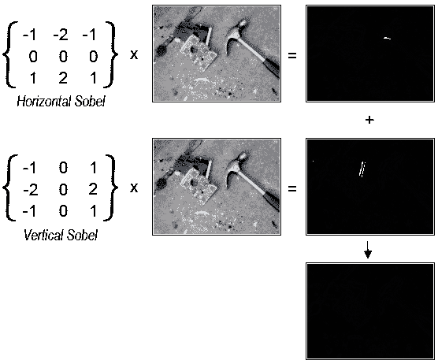

# Android NDK 的增强现实:第 2 部分

> 原文：<http://web.archive.org/web/20220810161336/https://imrannazar.com/Augmented-Reality-with-the-Android-NDK:-Part-2>

这个项目的源代码现在可以完整获得，地址:[http://imrannazar.com/content/files/android-sobel.zip](http://web.archive.org/web/20220810161353/http://imrannazar.com/content/files/android-sobel.zip)

在这组文章的[上一部分](http://web.archive.org/web/20220810161353/http://imrannazar.com/Augmented-Reality-with-the-Android-NDK:-Part-1)中，我开始介绍增强现实，使用 Android 智能手机上的边缘检测这个简单的例子；在该部分中，介绍了摄像机硬件，并开发了一个应用程序框架，以供摄像机预览使用。在这个结论部分，边缘检测算法本身及其实现将被探索。

### 索贝尔算子

将使用的算法是 [Sobel 算子](http://web.archive.org/web/20220810161353/http://en.wikipedia.org/wiki/Sobel_operator)，它作为应用于图像中每个像素的过滤器。该过程在图像的一行中的每个像素上迭代，并且依次在每行上，对每个像素值执行因式分解乘法:

 *Figure 1: Sobel operator formulation and example*

```
For Y = 1 to (Height-1)
    For X = 1 to (Width-1)
        Horiz_Sobel = (Input[Y-1][X-1] * -1) +
	              (Input[Y-1][X]   *  0) +
		      (Input[Y-1][X+1] *  1) +
		      (Input[Y]  [X-1] * -2) + 
		      (Input[Y]  [X]   *  0) +
		      (Input[Y]  [X+1] *  2) +
		      (Input[Y+1][X-1] * -1) +
		      (Input[Y+1][X]   *  0) +
		      (Input[Y+1][X+1] *  1)
        Vert_Sobel =  (Input[Y-1][X-1] * -1) +
	              (Input[Y-1][X]   * -2) +
		      (Input[Y-1][X+1] * -1) +
		      (Input[Y]  [X-1] *  0) + 
		      (Input[Y]  [X]   *  0) +
		      (Input[Y]  [X+1] *  0) +
		      (Input[Y+1][X-1] *  1) +
		      (Input[Y+1][X]   *  2) +
		      (Input[Y+1][X+1] *  1)
	Output[Y][X] = Pythag(Horiz_Sobel, Vert_Sobel)
    Next X
Next Y
```

Sobel 算子指数的计算可以通过两种方式简化:

*   **去除乘法**:算法使用的部分指标为零，表示计算中根本不使用关联项；相反，有些指数是负的，这意味着必须加上一个负值。用项的加法和减法代替乘法意味着需要更少的运算来产生值，使得计算更快。
*   **毕达哥拉斯加法的近似值**:出于本申请的目的，不需要合成 Sobel 值的精确值，仅仅是近似值；毕达哥拉斯算子的一个相对接近的近似值是所涉及的两个值的简单平均值。这个平均值将总是高于实际值，但将作为一个公平的替代。

通过这些修改，计算可适用于以下情况。

```
For Y = 1 to (Height-1)
    For X = 1 to (Width-1)
        Horiz_Sobel = Input[Y+1][X+1] - Input[Y+1][X-1] + Input[Y][X+1] +
		      Input[Y][X+1] - Input[Y][X-1] - Input[Y][X-1] +
		      Input[Y-1][X+1] - Input[Y-1][X-1]
	Vert_Sobel = Input[Y+1][X+1] + Input[Y+1][X] + Input[Y+1][X]  +
		     Input[Y+1][X-1] - Input[Y-1][X+1] - Input[Y-1][X] -
		     Input[Y-1][X] - Input[Y-1][X-1]
	Output[Y][X] = Clamp((Horiz_Sobel + Vert_Sobel) / 2)
    Next X
Next Y
```

在将此滤镜应用于相机预览图像之前，必须从相机中取出图像并准备好进行处理。

### 处理相机预览

正如在第 1 部分中介绍的，每当预览的一帧准备就绪时，摄像机硬件能够自动调用预定义的函数；该功能被称为“预览回调”，接收包含原始图像数据的`byte[]`。默认情况下，预览图像是标准亮度/色度格式的`NV21`格式；以 320x240 像素的 NV21 图像为例:

*   图像的前 76，800 字节是直接亮度图，每个字节对应于图像中相应像素的“亮度”或灰度值；
*   接下来的 38，400 字节是色度的 2x2 子采样:对于图像中的每个 2x2 像素块，一个字节编码 U 色度，接下来的字节编码 V 值。

对 NV21 图像的亮度部分执行 Sobel 计算相对简单，阈值结果可以放入每个输出像素的叠加画布中:

#### src/Sobel/overlay view . Java:Sobel 操作

```
    private int[] mFrameSobel;

    private void setPreviewSize(Camera.Size s)
    {
	// Allocate a 32-bit buffer as large as the preview
	mFrameSobel = new int[s.width * s.height];
        mFrameSize = s;
    }

    private void setCamera(Camera c)
    {
        mCam = c;
	mCam.setPreviewCallback(new PreviewCallback()
	{
	    // Called by camera hardware, with preview frame
	    public void onPreviewFrame(byte[] frame, Camera c)
	    {
		Canvas cOver = mOverSH.lockCanvas(null);
		try
		{
		    int x, y;
		    int w = mFrameSize.width, pos;
		    int sobelX, sobelY, sobelFinal;
		    for(y=1; y<(mFrameSize.height-1); y++)
		    {
		        pos = y * w + 1;

		        for(x=1; x<(mFrameSize.width-1); x++)
			{
			    sobelX = frame[pos+w+1] - frame[pos+w-1]
			           + frame[pos+1] + frame[pos+1]
				   - frame[pos-1] - frame[pos-1]
				   + frame[pos-w+1] - frame[pos-w-1];
			    sobelY = frame[pos+w+1] + frame[pos+w]
			           + frame[pos+w] + frame[pos+w-1]
				   - frame[pos-w+1] - frame[pos-w]
				   - frame[pos-w] - frame[pos-w-1];
			    sobelFinal = (sobelX + sobelY) / 2;

			    // Threshold at 48 (for example)
			    if(sobelFinal <  48)
			    	sobelFinal = 0;
			    if(sobelFinal >= 48)
			    	sobelFinal = 255;

			    // Build a 32-bit RGBA value, either
			    // transparent black or opaque white
			    mFrameSobel[pos] = (sobelFinal << 0) +
			                       (sobelFinal << 8) +
					       (sobelFinal << 16) +
					       (sobelFinal << 24);
			}
		    }

		    // Copy calculated frame to bitmap, then
		    // translate onto overlay canvas
		    Rect src = new Rect(0, 0, mFrameSize.width, mFrameSize.height);
		    Rect dst = new Rect(0, 0, cOver.getWidth(), cOver.getHeight());
		    Paint pt = new Paint();
		    Bitmap bmp = Bitmap.createBitmap(mFrameSobel,
		    				     mFrameSize.width,
		    				     mFrameSize.height,
						     Bitmap.Config.ARGB_8888);

		    pt.setColor(Color.WHITE);
		    pt.setAlpha(0xFF);
		    cOver.drawBitmap(bmp, src, dst, pt);
		}
		catch(Exception e)
		{
		    // Log/trap rendering errors
		}
		finally
		{
		    mOverSH.unlockCanvasAndPost(cOver);
		}
	    }
	});
    }
```

上述代码在作为相机预览的一部分运行时，会产生以下视图。

 *Figure 2: Application output*

### 优化操作

正如所写的，这个应用程序有一个问题:速度。当在硬件设备上运行时，覆盖计算不能保持增强显示的接近实时的速度；在我自己的硬件上，渲染速度达到了大约每秒 3 帧。这主要是因为计算是在 Dalvik 虚拟机中的托管内存缓冲区内执行的:对相机预览数据的每次访问都要检查边界条件，写入覆盖画布的每个像素值也是如此。所有这些对边界条件的检查都占用了索贝尔运算的时间。

为了缓解这个问题，计算可以在本机代码中执行，绕过虚拟机；这是通过 Android 本地开发套件(NDK)完成的。NDK 是 Java 本地接口(JNI)的一个实现，因此其行为方式与标准 JNI 非常相似:本地代码被放入符合特定命名标准的函数中，然后它们可以作为特殊标记的`native`函数从 Java VM 中被调用。

NDK 本地函数是根据它们的目标包和类来命名的:标准格式是`Java_<package>_<class>_<function>`。在这个特殊的例子中，目的地是包`sobel`和类`OverlayView`，所以接口可以构建如下。

#### jni/native.c: NDK 处理接口

```
#include <jni.h>

JNIEXPORT void JNICALL Java_sobel_OverlayView_nativeSobel(
	/* Two parameters passed to every JNI function */
	JNIEnv *env, jobject this,

	/* Four parameters specific to this function */
	jbyteArray frame, jint width, jint height, jobject out)
{
	/* Perform Sobel operation, filling "out" */
}
```

#### src/sobel/OverlayView.java:本地函数定义

```
class OverlayView
{
    private native void nativeSobel(byte[] frame,
    				    int width,
				    int height,
				    IntBuffer out);
}
```

注意，在上面的代码中，之前用于覆盖输出的`int[]`数组已经被一个`IntBuffer`所取代；这是为了允许本机工作访问原始内存缓冲区，因为标准的`int[]`内存是由 JVM 分配的，不能由 JNI 写入。`Buffer` s 被设计成允许通过对象的`GetDirectBufferAddress`函数直接访问缓冲存储器，我们可以用它来写 Sobel 操作的输出。

上面显示的操作的 Java 代码可以直接翻译成 C 代码，如下所示:

#### jni/native.c: Sobel 实现

```
#include <jni.h>

JNIEXPORT void JNICALL Java_sobel_OverlayView_nativeSobel(
	JNIEnv *env, jobject this,
	jbyteArray frame, jint width, jint height, jobject out)
{
	/* Get a pointer to the raw output buffer */
	jint *dest_buf = (jint*) ((*env)->GetDirectBufferAddress(env, out));

	/* Get a pointer to (probably a copy of) the input */
	jboolean frame_copy;
	jint *src_buf = (*env)->GetByteArrayElements(env, frame, &frame_copy);

	int x, y, w = width, pos = width+1;
	int maxX = width-1, maxY = height-1;
	int sobelX, sobelY, sobelFinal;

	for(y=1; y<maxY; y++, pos+=2)
	{
		for(x=1; x<maxX; x++, pos++)
		{
			sobelX = src_buf[pos+w+1] - src_buf[pos+w-1]
			       + src_buf[pos+1] + src_buf[pos+1]
			       - src_buf[pos-1] - src_buf[pos-1]
			       + src_buf[pos-w+1] - src_buf[pos-w-1];
			sobelY = src_buf[pos+w+1] + src_buf[pos+w]
			       + src_buf[pos+w] + src_buf[pos+w-1]
			       - src_buf[pos-w+1] - src_buf[pos-w]
			       - src_buf[pos-w] - src_buf[pos-w-1];

			sobelFinal = (sobelX + sobelY) >> 1;
			if(sobelFinal < 48)
				sobelFinal = 0;
			if(sobelFinal >= 48)
				sobelFinal = 255;

			dest_buf[pos] = (sobelFinal << 0)  |
					(sobelFinal << 8)  |
					(sobelFinal << 16) |
					(sobelFinal << 24);
		}
	}
}
```

#### src/sobel/OverlayView.java:调用本地函数

```
    private IntBuffer mFrameSobel;

    private void setPreviewSize(Camera.Size s)
    {
	// Allocate a 32-bit direct buffer as large as the preview
	mFrameSobel = ByteBuffer.allocateDirect(s.width * s.height * 4)
				.asIntBuffer();
        mFrameSize = s;
    }

    private void setCamera(Camera c)
    {
        mCam = c;
	mCam.setPreviewCallback(new PreviewCallback()
	{
	    // Called by camera hardware, with preview frame
	    public void onPreviewFrame(byte[] frame, Camera c)
	    {
		Canvas cOver = mOverSH.lockCanvas(null);
		try
		{
		    nativeSobel(frame,
		    		mFrameSize.width, mFrameSize.width, 
				mFrameSobel);

		    // Rewind the array after operation
		    mFrameSobel.position(0);

		    Rect src = new Rect(0, 0, mFrameSize.width, mFrameSize.height);
		    Rect dst = new Rect(0, 0, cOver.getWidth(), cOver.getHeight());
		    Paint pt = new Paint();
		    Bitmap bmp = Bitmap.createBitmap(mFrameSobel,
		    				     mFrameSize.width,
		    				     mFrameSize.height,
						     Bitmap.Config.ARGB_8888);

		    pt.setColor(Color.WHITE);
		    pt.setAlpha(0xFF);
		    cOver.drawBitmap(bmp, src, dst, pt);
		}
		catch(Exception e)
		{
		    // Log/trap rendering errors
		}
		finally
		{
		    mOverSH.unlockCanvasAndPost(cOver);
		}
	    }
	});
    }
```

一旦 Java 代码被配置为调用本地函数进行处理，JVM 的额外工作的减少导致了速度的显著提高:在我的硬件上进行测试时，每秒 15-20 帧的速度是很容易实现的，这可以通过进一步优化算法来提高。

### 最后

NDK 的 Android 文档说明:

> "使用本机代码不会自动提高性能，但总是会增加应用程序的复杂性."

对于这里介绍的内存密集型处理，NDK 比 Java 虚拟机有一个显著的优势，因为它不对数组和指针访问执行边界检查。由于大多数增强现实应用程序需要处理相机预览图像，并在预览图像上提供覆盖，因此将处理分流到 NDK 函数中的技术会很有用。

2011 年 5 月，伊姆兰·纳扎尔<>。

*文章日期:2011 年 5 月 21 日*