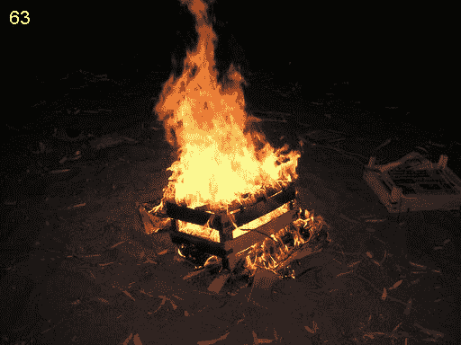

# Android NDK 增强现实:第 1 部分

> 原文：<http://web.archive.org/web/20220810161336/https://imrannazar.com/Augmented-Reality-with-the-Android-NDK:-Part-1>

这个项目的源代码现在可以完整获得，地址:[http://imrannazar.com/content/files/android-sobel.zip](http://web.archive.org/web/20220810161353/http://imrannazar.com/content/files/android-sobel.zip)

智能手机应用程序需要承担的最艰巨的任务之一是“增强现实”:用实时叠加的信息来显示世界。这通常是通过在预览模式下使用智能手机的摄像头来实现的，以提供半透明覆盖的基础；任务的强度在于在时间敏感的环境中计算覆盖图的内容。

本文希望分两部分介绍在基于 Android 的智能手机设备上实现的增强现实。将使用在摄像机的当前视图上运行的边缘检测器的例子来介绍该过程，并且沿着摄像机视图实时更新。产生这种视图所涉及的许多过程将适用于任何试图提供基于摄像机的视图的软件，因此这里给出的代码将更广泛地应用于这类程序。

本文将使用的边缘检测算法是 [Sobel 算子](http://web.archive.org/web/20220810161353/http://en.wikipedia.org/wiki/Sobel_operator)；稍后将详细介绍该算法，但是这里开发的应用程序将作为一个整体以该操作符命名。应用程序的输出示例如下所示。

 *Figure 1: Sample output*

### 提供摄像机视图

为了在相机预览屏幕上叠加数据，必须能够显示相机预览；这是通过将预览渲染到表面上来实现的。要实现这一点，最简单的方法是在应用程序的主布局上放置一个`SurfaceView`类型的视图，并将其放置在覆盖屏幕的位置。这可以通过标准布局 XML 来实现:

#### res/layout/main.xml:相机预览的主布局

```
<?xml version="1.0" encoding="utf-8"?>
<FrameLayout xmlns:android="http://schemas.android.com/apk/res/android"
  android:orientation="vertical"
  android:layout_width="fill_parent"
  android:layout_height="fill_parent">
    <SurfaceView android:id="@+id/surface_camera"
      android:layout_width="fill_parent"
      android:layout_height="fill_parent" />
</FrameLayout>
```

有了可用的`SurfaceView`,应用程序的主活动可以将一个表面及其关联的画布放置到视图上。为此，应用程序需要充当一个`SurfaceHolder`，并实现一个`SurfaceHolder.Callback`的方法；这允许 Android 操作系统将活动视为渲染表面的端点。在代码中，将活动定义为表面持有者回调是一个简单的过程:`SurfaceHolder.Callback`接口提供了三种方法。

#### java:主要活动

```
package sobel;
public class Sobel extends Activity implements SurfaceHolder.Callback
{
    /* Activity event handlers */
    // Called when activity is initialised by OS
    @Override
    public voidonCreate(Bundle inst)
    {
    	super.onCreate(inst);
	setContentView(R.layout.main);

	// Initialise camera
	initCamera();
    }

    // Called when activity is closed by OS
    @Override
    public void onDestroy()
    {
        // Turn off the camera
	stopCamera();
    }

    /* SurfaceHolder event handlers */
    // Called when the surface is first created
    public void surfaceCreated(SurfaceHolder sh)
    {
        // No action required
    }

    // Called when surface dimensions etc change
    public void surfaceChanged(SurfaceHolder sh,
                               int format,
			       int width,
			       int height)
    {
        // Start camera preview
	startCamera(sh, width, height);
    }

    // Called when the surface is closed/destroyed
    public void surfaceDestroyed(SurfaceHolder sh)
    {
        // No action required
    }
}
```

上面的代码将处理应用程序及其表面的初始化，但相机硬件需要初始化和设置预览可用。这分三步完成:

1.  **应用程序初始化时，打开**相机；
2.  **为相机设置参数**，包括预览的宽度和高度；
3.  **开始预览**并为预览输出设置表面。

可以填写上面代码示例中提到的相机助手函数来执行这些步骤:

#### src/sobel/Sobel.java:照相机初始化

```
    private Camera mCam;
    private SurfaceView mCamSV;
    private SurfaceHolder mCamSH;

    // Initialise camera and surface
    private void initCamera()
    {
    	mCamSV = (SurfaceView)findViewById(R.id.surface_camera);
	mCamSH = mCamSV.getHolder();
	mCamSH.addCallback(this);

	mCam = Camera.open();
    }

    // Setup camera based on surface parameters
    private void startCamera(SurfaceHolder sh, int width, int height)
    {
    	Camera.Parameters p = mCam.getParameters();
	p.setPreviewSize(width, height);

	mCam.setParameters(p);

	try
	{
	    mCam.setPreviewDisplay(sh);
	}
	catch(Exception e)
	{
	    // Log surface setting exceptions
	}

	mCam.startPreview();
    }

    // Stop camera when application ends
    private void stopCamera()
    {
        mCamSH.removeCallback(this);

    	mCam.stopPreview();
	mCam.release();
    }
```

设置相机时要考虑的一个问题是，为预览准备的表面大小可能不是相机子系统支持的大小。如果是这种情况，并且该活动尝试基于图面大小设置预览大小，则应用程序可能会在启动时强制关闭。解决方法是在设置预览尺寸时不使用表面的尺寸，而是询问相机支持哪些预览尺寸，并使用其中一个尺寸。可以通过相机的`Parameters`对象检索预览尺寸列表:

#### java:使用支持的预览大小

```
    private void startCamera(SurfaceHolder sh, int width, int height)
    {
    	Camera.Parameters p = mCam.getParameters();
	for(Camera.Size s : p.getSupportedPreviewSizes())
	{
	    // In this instance, simply use the first available
	    // preview size; could be refined to find the closest
	    // values to the surface size
	    p.setPreviewSize(s.width, s.height);
	    break;
	}

	mCam.setParameters(p);

	try
	{
	    mCam.setPreviewDisplay(sh);
	}
	catch(Exception e)
	{
	    // Log surface setting exceptions
	}

	mCam.startPreview();
    }
```

该应用程序现在可以生成摄像机当前视野的预览。预览可以出现在应用标题栏、通知区域等旁边；为了移除这些并获得预览的无障碍呈现，应用程序可以请求全屏显示:

#### java:全屏活动

```
    @Override
    public void onCreate(Bundle inst)
    {
    	super.onCreate(inst);

	getWindow().setFlags(WindowManager.LayoutParams.FLAG_FULLSCREEN,
	                     WindowManager.LayoutParams.FLAG_FULLSCREEN);
	setContentView(R.layout.main);
	initCamera();
    }
```

### 提供覆盖

既然相机预览正在被渲染成`SurfaceView`，增强现实的下一步就是能够在预览图像上绘制像素和/或形状。由于相机硬件直接绘制到它可用的表面，该表面不能用于额外的绘制:对该表面的任何输出将被相机自动覆盖。

这个问题可以通过提供一个额外的表面来解决，该表面位于相机预览的顶部，应用程序可以在其上绘制东西。新的 surface 也可以是一个`SurfaceView`，但是如果在这种情况下使用基本的 Android 视图，它不能用于绘制动态内容:`SurfaceView`必须扩展到一个新的类中。出于本申请的目的，该类可称为`OverlayView`:

#### src/sobel/OverlayView.java:类定义

```
package sobel;
public class OverlayView extends SurfaceView
{
    private SurfaceHolder mOverSH;

    public void OverlayView(Context ctx, AttributeSet attr)
    {
    	super(ctx, attr);

	mOverSH = getHolder();
    }
}
```

#### java:初始化 OverlayView

```
    private OverlayView mOverSV;

    private void initCamera()
    {
    	mCamSV = (SurfaceView)findViewById(R.id.surface_camera);
	mCamSH = mCamSV.getHolder();
	mCamSH.addCallback(this);

	mCam = Camera.open();

	mOverSV = (OverlayView)findViewById(R.id.surface_overlay);
	mOverSV.getHolder().setFormat(PixelFormat.TRANSLUCENT);
	mOverSV.setCamera(mCam);
    }

    private void startCamera(SurfaceHolder sh, int width, int height)
    {
    	Camera.Parameters p = mCam.getParameters();
	for(Camera.Size s : p.getSupportedPreviewSizes())
	{
	    p.setPreviewSize(s.width, s.height);
	    mOverSV.setPreviewSize(s);
	    break;
	}
	// ...
    }
```

为了将这个新的视图类放置在摄像机的预览表面上，需要修改布局 XML 以预先加载到覆盖视图中:

#### res/layout/main.xml:覆盖预览的主布局

```
<?xml version="1.0" encoding="utf-8"?>
<FrameLayout xmlns:android="http://schemas.android.com/apk/res/android"
  android:orientation="vertical"
  android:layout_width="fill_parent"
  android:layout_height="fill_parent">
    <sobel.OverlayView android:id="@+id/surface_overlay"
      android:layout_width="fill_parent"
      android:layout_height="fill_parent" />
    <SurfaceView android:id="@+id/surface_camera"
      android:layout_width="fill_parent"
      android:layout_height="fill_parent" />
</FrameLayout>
```

有了覆盖图，就需要绘制覆盖图上的内容，并定期更新。在表面上绘图是计算机图形学中一个熟悉的概念，需要锁定画布并将图元绘制到画布上；保持画布根据相机预览定期更新有点不太熟悉。有两种方法可以实现定期更新:

*   **Timing**:overlay view 的一个方法每隔几毫秒被调用一次，从它的渲染表面获取当前的相机预览。这是一个理论上合理的概念，但是相机硬件永久锁定了预览图面，所以应用程序无法访问它。
*   **回调**:overlay view 的一个方法被定义为“预览回调”，每当一个预览被渲染时，由相机硬件自动调用。这种方法的内在优势在于，相机提供了相机预览内容的`byte[]`,这可以很容易地用于叠加的计算。

要在 OverlayView 中设置一个方法的回调，视图必须首先知道摄像机:摄像机的句柄必须从主活动传递过来。此外，OverlayView 知道它正在处理的预览图像的大小也很有用，因为回调方法不提供尺寸。对这些方法的调用可以在上面来自`Sobel.java`的代码示例中看到，是在初始化时进行的；这些方法概述如下。

#### src/sobel/OverlayView.java:设置回调

```
    private Camera mCam;
    private Camera.Size mFrameSize;

    // Called by Sobel.surfaceChanged, to set dimensions
    private void setPreviewSize(Camera.Size s)
    {
        mFrameSize = s;
	mFrameCount = 0;
    }

    // Called by Sobel.initCamera, to set callback
    private void setCamera(Camera c)
    {
        mCam = c;
	mCam.setPreviewCallback(new PreviewCallback()
	{
            private int mFrameCount;

	    // Called by camera hardware, with preview frame
	    public void onPreviewFrame(byte[] frame, Camera c)
	    {
		Canvas cOver = mOverSH.lockCanvas(null);
		try
		{
	            // Perform overlay rendering here
		    // Here, draw an incrementing number onscreen
		    Paint pt = new Paint();
		    pt.setColor(Color.WHITE);
		    pt.setTextSize(16);
		    cOver.drawText(Integer.toString(mFrameCount++),
		                   10, 10, pt);
		}
		catch(Exception e)
		{
		    // Log/trap rendering errors
		}
		finally
		{
		    mOverSH.unlockCanvasAndPost(cOver);
		}
	    }
	});
    }
```

在硬件上运行上述代码会产生类似下图的结果:

 *Figure 2: Overlay canvas rendering*

### 在第 2 部分:边缘检测中

上面的代码使应用程序可以从相机预览中检索数据(通过预览帧回调的`byte` []参数)，并呈现一个覆盖图。在本文的第二部分，我将看看预览数据如何通过 Sobel 边缘检测过滤器，以及结果如何显示在覆盖图中。

2011 年 4 月，伊姆兰·纳扎尔<>。

*文章日期:2011 年 4 月 21 日*