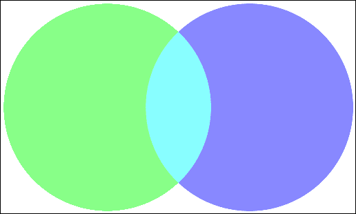
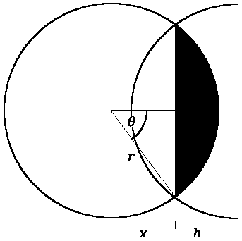
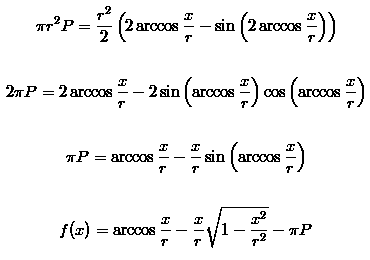
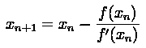

# PHP 和 imagick 中的维恩图

> 原文：<http://web.archive.org/web/20220810161336/https://imrannazar.com/Venn-Diagrams-in-PHP-and-imagick>

数据可视化中的一个常见问题是两个数据集的表示，这两个数据集有一个公共的元素子集:它们的内容在两者中都存在的百分比。这个问题的显而易见的解决方案是画一个文氏图:两个重叠的圆，其中重叠部分代表共同元素的百分比。

 *Figure 1: A sample Venn diagram, with data sets of green and blue, and common elements in cyan*

绘制文氏图的主要问题是，给定重叠的百分比，确定圆的位置，使其在视觉上与指定的重叠相匹配。一旦确定了圆的尺寸和位置，图像操作就相对简单了。

在本文中，我将使用 PHP 来演示实现，并使用 ImageMagick 的`imagick`接口来绘制和输出图像。

### 几何图形:重叠圆

数学上，两个重叠的圆会在两点上相交:这两点之间的一条线是圆的一条*弦*，这条线包含在每个弦段内的面积是总重叠的 50%。

 *Figure 2: Circle segment dimensions*

为了正确放置圆圈，找出上图中的 *x* 和 *h* 是什么很重要；知道这些值将允许容易地计算水平位置。使用[标准公式](http://web.archive.org/web/20220810161352/http://en.wikipedia.org/wiki/Circle_segment#Formula)计算一个圆弧的面积和角度，可以得到下面的公式。

 *Formula 1: Length of the sagitta*

通过解这个方程，我们可以得到矢的长度， *x* 。然而，这个方程提出的问题是，它不能通过处理方程项来解析地解决。需要使用数值方法来寻找解决方案。

### 牛顿-拉夫森迭代法

求解方程的最常见的数值算法之一是牛顿-拉夫森方法，也称为牛顿法。它利用函数在特定点的梯度，来猜测下一个点。通过选择一个好的起点，可以快速缩小函数的解的范围(与 x 轴相交的点)。

 *Figure 3: An example of the Newton-Raphson method*

从上图中可以看出，该算法沿着梯度线向下到 x 轴，并使用那里的交叉点作为下一个解的猜测。从该点的函数中取另一个梯度，算法在 4 或 5 次迭代内(在上述情况下)找到解。当用于公式时，梯度由所讨论的公式的微分来表示；对于矢长公式，微分为:

 *Formula 2: Differential of the sagitta length*

有了这两个公式(函数本身和微分)，迭代过程就是一个简单的计算:

 *Formula 3: The Newton-Raphson algorithm*

这种计算可以重复，直到答案接近预期的解决方案:换句话说，当连续的迭代不会导致答案的重大变化。“显著变化”的定义取决于问题:在这种情况下，我将使用“小数点后四位相同”。

例如，假设正在生成图 1 中的维恩图:一个显示 20%重叠的图，其中每个圆的半径为 150 个像素。将这些值代入 Newton-Raphson 解算器，会显示每次迭代的以下值。

#### 示例图的迭代结果

```
0.0000
94.2478
102.7742
103.0570
103.0573
103.0573
```

可以看出，求解器很快收敛于长度为 *x* 的答案。从这里， *h* 可以计算为 *x* 与半径之差，角度 *θ* 为:

 *Formula 4: Angle for circle segment*

### 实现求解器

在 PHP 中，可以通过将 sagitta 公式及其微分定义为两个函数，并使用递归函数遍历它们的值来实现求解器。以下实现包含求解器的“安全阀”,适用于求解器从 *x* =0 开始时方程可能导致发散的一般情况。在这个等式的情况下，安全阀是不必要的，因为如果从 0 开始，算法将总是收敛；为了完整起见，将它包括在下面。

#### 迭代求解器实现

```
class Sagitta
{
	// The sagitta length formula
	static function f($x, $r, $P)
	{
		return acos($x/$r)-(M_PI*$P)-(($x/($r*$r))*sqrt(($r+$x)*($r-$x)));
	}

	// Differential of the length
	static function fp($x, $r, $P)
	{
		$s = sqrt(1-(($x*$x)/($r*$r)));
		return (((($x*$x)/($r*$r*$r)) - (1/$r)) / $s) - ($s/$r);
	}

	// Recursive solver
	// Built-in safety valve at 10 levels down
	static function solve($x, $r, $P, $level=10, $precision=0.0001)
	{
		$xn = $x - (self::f($x,$r,$P) / self::fp($x,$r,$P));
		if($level && (abs($xn - $xn) > $precision))
			return self::solve($xn, $r, $P, $level-1);
		else
			return $xn;
	}
}

$radius = 150;
$overlap = 0.2;

// Each circle contains half of the overlap; use this to calculate x
$x0 = 0;
$x = Sagitta::solve($x0, $radius, $overlap/2);
```

### 画维恩图

使用 PHP 和`imagick`，可以根据上面得到的 *x* 的值快速有效地绘制出维恩图。然而，有几个问题必须解决:

*   **圆放置**:为了在`imagick`中绘制一个圆，必须给出它的中心坐标，并且必须对两个圆进行水平计算。对于左边的圆，这只是从图像的左边开始的一个半径。如果没有重叠，右边的圆将是从左边缘的三个半径；从图 2 中可以看出有 2 个 *h* 的重叠，所以这必须从右手圆的横坐标中减去。
*   **交点**:这两个圆很容易画，但是代表交点的圆段可能会造成困难。幸运的是，`imagick`提供了一个绘制椭圆线段的构造:给定两个角度，它将绘制出它们之间的弧和弦，并用预先定义的“填充颜色”填充空间。
*   **图像尺寸**:与圆形布局一样，图像的水平尺寸低于预期。如果没有重叠，图像将和两个圆的直径加在一起一样宽；如果图像不太宽，则必须再次从中减去 2 *h* 的重叠。

考虑到这些问题，下面的代码将生成给定为 *x* 的维恩图。

#### 图像渲染实现

```
$h = $radius - $x;
$theta = acos($x/$r) * (180 / M_PI);

// 5 pixels of padding around the Venn
$padding = 5;
$overlap_width = 2*$h;

$im = new Imagick();
$im->newImage($r*4 - $overlap_width + ($padding*2),
              $r*2 + ($padding*2),
	      new ImagickPixel('white'));

$draw = new ImagickDraw();

// Left-hand circle, in green
$draw->setFillColor(new ImagickPixel('#88ff88'));
$draw->ellipse($r + $padding, $r + $padding,
               $r, $r,
	       0, 360);

// Right-hand circle, in blue
$draw->setFillColor(new ImagickPixel('#8888ff'));
$draw->ellipse($r*3 - $overlap_width + $padding, $r + $padding,
               $r, $r,
	       0, 360);

// Intersection, in cyan
// Angles are specified in degrees, from the rightmost point of the circle
$draw->setFillColor(new ImagickPixel('#88ffff'));

// Left-hand segment (right half of intersection)
// -theta is in the top right, +theta in the bottom right
$draw->ellipse($r + $padding, $r + $padding,
               $r, $r,
	       -$theta, $theta);

// Right-hand segment (left half of intersection)
// 180-theta is in the bottom left, 180+theta in the top left
$draw->ellipse($r*3 - $overlap_width + $padding, $r + $padding,
               $r, $r,
	       180-$theta, 180+$theta);

// Image bounding rectangle
$draw->setStrokeColor(new ImagickPixel('black'));
$draw->setStrokeWidth(1);
$draw->setFillOpacity(0);
$draw->rectangle(0, 0,
                 $r*4 - $overlap_width + ($padding*2) - 1,
		 $r*2 + $padding - 1);

// Output image
$im->drawImage($draw);
$im->setImageFormat('png');
header('Content-type: image/png');
echo $im;
```

上述代码的结果如图 1 所示。

### 问题和改进

这种实现仍然存在的一个问题是重叠百分比的范围。如果给定的重叠小于 0%(换句话说，如果集合不重叠)，上面的等式会导致复杂的根，并且在试图计算它们时 PHP 会崩溃。类似地，如果重叠被指定为大于 100%，这将反转维恩图中集合的位置；相反，这些方程将产生一个圆的一小部分，它被渲染为所有的交点。对重叠百分比进行简单的范围检查可以缓解这些问题，并防止它们传递给脚本。

另一个限制是这个脚本隐含的两个集合的内在联系；使用此模型不可能指定三个集合之间的重叠。允许指定三个相交圆的几何图形留给读者作为练习。

2010 年 5 月，伊姆兰·纳扎尔<>。

*文章日期:2010 年 5 月 20 日*