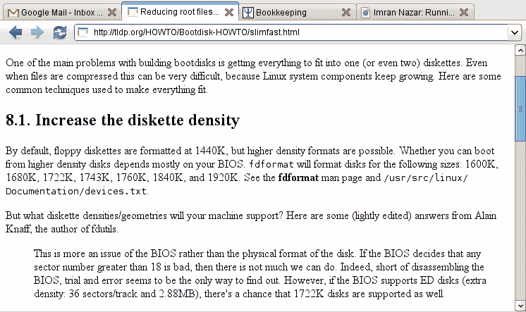
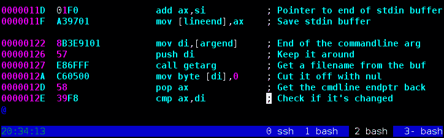
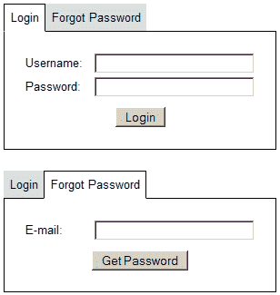

#  JavaScript 选项卡控件

> 原文：<http://web.archive.org/web/20220810161336/https://imrannazar.com/JavaScript-Tab-Controls>

HTML 页面上最基本的显示元素很容易理解:段落、标题和表格。通常，一个页面被分成几个部分，每个部分包含这些元素；这些部分可以在 HTML 源代码中定义为块。由此产生的问题是如何以直观的方式显示各个部分。

一个例子是登录表单，您可以在其上提供用户名和密码来登录。该页面的另一部分提供了一个“忘记密码”的表单，在这里可以输入一个电子邮件地址并发送一封检索电子邮件。这一页可以分为两部分，如下所示。

#### 两段式登录表单

```
<h2>Login</h2>
<form action="/login" method="post">
 <fieldset>
  <legend>Provide login details</legend>
  <label for="user">Username:</label><input type="text" name="username" id="user">
  <label for="pass">Password:</label><input type="password" name="password" id="pass">
  <input type="hidden" name="do" value="login">
  <input type="submit" name="go" value="Login">
 </fieldset>
</form>
<h2>Forgot Password</h2>
<form action="/login" method="post">
 <fieldset>
  <legend>Provide e-mail</legend>
  <label for="email">E-mail:</label><input type="text" name="email" id="email">
  <input type="hidden" name="do" value="forgot">
  <input type="submit" name="go" value="Get Password">
 </fieldset>
</form>
```

将这两种形式直接放在一起可能会给用户带来一些困惑。有几种方法可以缓解这种情况:例如，将两个表单放在一起，可以在视觉上分离两种功能。然而，在这种情况下，最有效的显示方法是跳转。

### 标签系统

很可能你以前遇到过选项卡:它们已经被 web 浏览器使用了很多年，作为在同一个浏览器窗口中显示多个页面的一种方式。标签系统有两个组成部分:标签列表和标签内容。选项卡列表中的每个条目都有一个关联的内容块:当选项卡列表中的给定条目被选择时，该条目的内容块被显示，而其他内容块被隐藏。

 *Figure 1: Graphical tabs, in a web browser*

在上面的示例中，在同一个 web 浏览器实例中打开了四个单独的页面:选择了第二个页面。可以看到，很明显选择了哪个选项卡，结果显示了哪些内容。然而，标签不仅仅是一个图形概念:它们同样可以在基于文本的环境中使用。

 *Figure 2: Textual tabs, in a multi-terminal environment*

在本例中，在多终端屏幕中打开了四个终端，每个终端在底部的选项卡列表中都有一个条目。第三个终端(编辑器会话)当前被选中，选项卡列表通过突出显示第三个选项卡来反映这一点。

网页中的选项卡在视觉上与这两种界面非常相似；上述登录和忘记密码界面的示例可以按照下图实现。

 *Figure 3: Two tabs of a login page*

### 实现:HTML

如上所述，在应用制表符之前，必须对制表符内容进行分段；还必须有一个选项卡列表，以允许在选项卡之间切换。分解内容的一个简单方法是将每个部分放在一个`DIV`中。通过赋予每个`DIV`一个`id`，作为列表项上的`rel`属性，来维护页签列表项与页签内容的对应关系。如 JavaScript 部分所述，选项卡切换器将使用这个`rel`来确定切换哪个选项卡内容。

#### 包含选项卡代码的两部分登录表单

```
<ul class="tablist" id="tablist-login">
 <li rel="tab-login">Login</li>
 <li rel="tab-forgot">Forgot Password</li>
</ul>
<div class="tab" id="tab-login">
 <form action="/login" method="post">
  <fieldset>
   <legend>Provide login details</legend>
   <label for="user">Username:</label><input type="text" name="username" id="user">
   <label for="pass">Password:</label><input type="password" name="password" id="pass">
   <input type="hidden" name="do" value="login">
   <input type="submit" name="go" value="Login">
  </fieldset>
 </form>
</div>
<div class="tab" id="tab-forgot">
 <form action="/login" method="post">
  <fieldset>
   <legend>Provide e-mail</legend>
   <label for="email">E-mail:</label><input type="text" name="email" id="email">
   <input type="hidden" name="do" value="forgot">
   <input type="submit" name="go" value="Get Password">
  </fieldset>
 </form>
</div>
```

### 实现:CSS

tablist 中的每个选项卡可以处于两种状态之一:活动(当前选定的选项卡)或非活动。在上面的例子中，标签列表被编码为一个无序列表，这意味着如果列表项要出现在同一行上，它们必须彼此相邻浮动。

选项卡内容`DIV`的样式很简单:黑色边框就足够了。然而，标签列表的位置必须使“活动”标签在视觉上与标签内容合并。最简单的方法是给活动选项卡和选项卡内容框相同的背景(在本例中为白色)，并在活动选项卡上设置白色的下边框。从这里开始，选项卡列表可以放置在选项卡内容的上面，使活动选项卡的白色边框在视觉上覆盖内容的黑色边框。

在 CSS 中，实现可能如下所示。

#### 用于选项卡呈现的 CSS

```
/* Tab list: no bullets */
ul.tablist {
  list-style: none inside;
  margin: 0;
  padding: 0;
}

/* Tab list item: floated, pushed down one pixel */
ul.tablist li {
  display: block;
  float: left;
  background: #ddd;
  border-top: 1px solid #ddd;
  border-bottom: 1px solid black;
  position: relative;
  bottom: -1px;
  padding: 0.5em;
  margin-right: 2px;
  cursor: pointer;
}

/* Tab list item (active): white bottom border */
ul.tablist li.active {
  background: white;
  border-left: 1px solid black;
  border-right: 1px solid black;
  border-top: 1px solid black;
  border-bottom: 1px solid white;
}

/* Tab: black border */
div.tab {
  border: 1px solid black;
  clear: both;
  padding: 0.5em;
}
```

### 实现:JavaScript

跳转系统最重要的部分是活动组件:当点击标签列表上的一个项目时，它切换到一个标签并切换出其他标签。为此，必须维护特定列表中的标签列表项目的映射；这个地图可以在页面加载时创建。

在初始化时，标签列表中的每个项目也被赋予一个`onclick`功能，以便在用户点击标签时激活切换机制。该机制是一个简单的循环，它确定要切换哪些选项卡内容框，并隐藏除了被请求的选项卡之外的所有选项卡。

#### JavaScript 标签切换器

```
tabSwitcher = {
  _map: {},

  init: function()
  {
    // Check each UL on the page, to see if it's a tablist
    lists = document.getElementsByTagName('ul');
    for(i=0; i<lists.length; i++)
    {
      if(lists[i].className.indexOf('tablist') >= 0)
      {
        // If we find a tablist, put each item in the map
	items = lists[i].getElementsByTagName('li');
	for(j=0; j<items.length; j++)
	{
	  // Map the item's REL attribute to this tablist
	  tabSwitcher._map[items[j].getAttribute('rel')] = lists[i].id;

	  // When the user clicks this item, run switcher
	  items[j].onclick = function()
	  {
	    tabSwitcher.action(this.getAttribute('rel'));
	    return false;
	  };
	}

	// Leave this tab list in a default state of
	// first item active
	tabSwitcher.action(items[0].getAttribute('rel'));
      }
    }
  },

  action: function(target)
  {
    // Fetch all the tab list items in the same list as the target
    tablist = document.getElementById(tabSwitcher._map[target]);
    listitems = tablist.getElementsByTagName('li');

    for(k=0; k<listitems.length; k++)
    {
      // If this item's REL is the same as the clicked item,
      // activate the tab list item and show the content
      rel = listitems[k].getAttribute('rel');
      if(rel == target)
      {
        listitems[k].className = 'tab_hi';
        document.getElementById(rel).style.display = 'block';
      }

      // Otherwise, make the tab list item inactive and hide the content
      else
      {
        listitems[k].className = 'tab';
        document.getElementById(rel).style.display = 'none';
      }
    }
  }
};

window.onload = tabSwitcher.init;
```

将所有这些代码段放在一起可以提供:

*   注册
*   忘记密码

<form action="" method="post">

<fieldset><legend>User information</legend> <input type="hidden" name="action" value="user:login"> <label for="user" class="reqd {$BadUser}">Username:<input type="text" name="user" id="user" value=""></label> <label for="pass" class="reqd {$BadPass}">Password:<input type="password" name="pass" id="pass"></label> <input class="submit" type="submit" name="login" value="Login"></fieldset>

</form>

<form action="" method="post">

<fieldset><legend>User information</legend> <input type="hidden" name="action" value="user:forgot"> <label for="email" class="reqd {$BadEmail}">E-mail:<input type="text" name="email" id="email" value=""></label> <input class="submit" type="submit" name="forgot" value="Get Password"></fieldset>

</form>

*图 4:选项卡式界面示例*

### 高级用法:多个选项卡列表

由于上面的 JavaScript 代码被设计成将一个选项卡列表项映射到包含它的列表中，所以可以在同一个页面上放置多个选项卡列表，并让每个列表独立工作；选项卡切换器将在其内部映射中维护与适当选项卡列表的关系。这可以用于详细的向下钻取显示，或者选项卡列表可以嵌套在另一个选项卡中的任何其他点。

还可以增强标签的样式，以明智地使用圆形标签、颜色等；由于样式已经从表示 HTML 中分离出来，重新设置选项卡的样式仅仅是改变用于定义选项卡样式的 CSS。

2009 年[tf@oopsilon.com](http://web.archive.org/web/20220810161352/mailto:tf@oopsilon.com)>

文章日期:2009 年 3 月 8 日