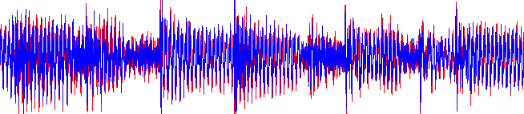
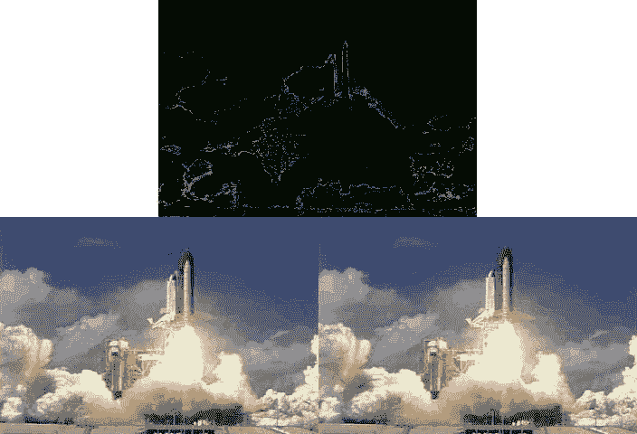
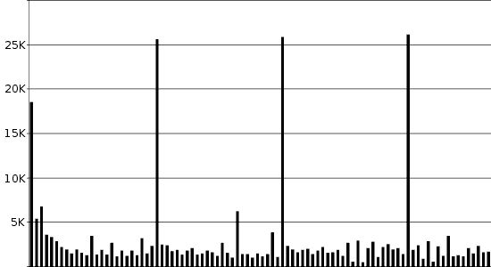

# 压缩简介

> 原文：<http://web.archive.org/web/20220810161336/https://imrannazar.com/An-Introduction-to-Compression>

我最近开始思考 GIF 和 JPEG 图像格式之间的区别:为什么有些图像保存为 GIF 时在磁盘上更大，而另一些图像保存为 JPEG 时更大？事实证明，不同的图像格式使用不同的压缩方法。

压缩仅仅是一组过程的名称，这些过程允许将数据压缩到更小的空间中，同时允许从压缩编码中检索数据。这是一个双向过程:输入文件可以产生压缩输出，但是将压缩输出放回到算法中应该会给你一个输入的副本。

### 冗余:游程编码

使压缩成为可能的概念是冗余:大多数数据以某种方式重复自身的事实。例如，一个文档可能多次使用同一个单词，或者一张图片在许多地方包含相同的颜色。冗余数据的一个非常简单的例子如下。

#### 冗余:压缩前

```
AAAAABBWWWWWWWWWPPPPQZMMMMVVV
```

在这种情况下，冗余是明显的；一系列重复的字母出现在整个样本中。一种简单的压缩方法是用重复次数来表示重复的字母，这样就减少了样本的总长度。

#### 冗余:压缩后

```
A5B2W9P4Q1Z1M4V3
```

读取样本的这种编码版本的算法将能够完美地检索原始数据:“A”五次，“B”两次，以此类推。这种简单的算法被广泛使用，被称为游程编码(RLE):记下每个字符的游程有多长。采用 RLE 的广泛使用的标准的一个例子是古老的 PCX 图像格式。

 *Figure 1: Stripes ([Gottschal](http://web.archive.org/web/20220810161352/http://www.thisisnotparis.com/)/[Schuster](http://web.archive.org/web/20220810161352/http://www.gluecksbazillus.de/))*

在图 1 中，有许多单色的实体块。这张图片宽 500 像素，高 190 像素；作为原始位图，使用一个字节表示一个像素，该图像将构成 95kB 的数据。PCX 算法计算图像中每行像素的游程长度，然后保存相同颜色的连续像素的游程长度:通过这种方式，图像的大小减少到 52kB。

### 频率:霍夫曼编码

RLE 的一个主要问题是它作用于连续的数据值:在图 1 中，RLE 算法将单独处理图像的每一条水平线，而所有的线都是相同的。这可以通过从整体上查看数据，并构建一个表来显示每个值在整个数据集中出现的频率来缓解。

霍夫曼编码是一种使用“频率表”的方法，它表示每个值出现的频率，并为每个条目分配一个代码。最频繁的条目被赋予较短的代码，而较少的条目被归入接收长代码。在计算中，这些代码总是二进制代码，然后可以组合成字节用于文件存储。

使用上面的例子，样本霍夫曼编码过程可以如下运行:

#### 霍夫曼编码:压缩前

```
AAAAABBWWWWWWWWWPPPPQZMMMMVVV
```

| 价值 | 频率 | 密码 |
| Q | one | 000000 |
| Z | one | 000001 |
| B | Two | 00001 |
| V | three | 0001 |
| P | four | 001 |
| M | four | 011 |
| A | five | 01 |
| W | nine | one |

*Table 1: Frequency and Huffman table*

#### 霍夫曼编码:压缩后

```
01 01 01 01 01 00001 00001 1 1 1 1 1 1 1 1 1 001 001 001 001 000000 000001 011 011 011 011 0001 0001 0001
UBù$€m±ˆ
```

使用霍夫曼编码，数据已经从 29 个字符减少到 10 个字节。这不包括频率和编码表，该表必须与压缩数据一起存储才能有意义；在本例中，频率表大于压缩数据，但在大多数情况下，频率表的大小可以忽略不计。

当然，可以结合 RLE 和霍夫曼编码，首先执行 RLE，然后通过霍夫曼算法运行压缩结果。这在简单的图像上产生特别好的结果:上面的图 1 可以通过使用 GIF 文件格式从 95kB 位图压缩到 4kB 文件，它结合了 RLE、霍夫曼编码和其他算法。

### 感知:有损编码

上面概述的方法可以用于以可以完美再现的方式压缩数据。压缩的这种用法的例子包括文档和软件程序，其中一个值的丢失或损坏可能使文件变得一文不值。

在某些情况下，没有必要对所讨论的数据进行完美的复制:一个接近的近似值就足够了。一般来说，这些情况出现在多媒体应用中:超出人类听觉范围的声音不需要被记录，并且超出人类眼睛辨别能力的颜色和渐变的微妙之处不需要被再现。

这方面的一个经典例子是 MPEG 音频标准，它试图通过删除与高频声音相关的无关信息来减小音频文件的大小。该标准的第 3 层规范允许各种去除设置，通过这些设置，将逐渐从音频样本中去除更多的信息。

 *Figure 2: Yardım Et ([Mor ve Ötesi](http://web.archive.org/web/20220810161352/http://www.morveotesi.com/), "Dünya Yalan Söylüyor")
Encoded with MPEG Audio Layer-3*

在上面的图 2 中，叠加了两个波形:红色的原始歌曲波形，以及蓝色的高度压缩的变体。上面显示的示例长度为 1.5 秒；作为原始波形文件中的一部分，该样本使用 160kB 的数据进行存储。所示的压缩版本具有相同的长度，仅占用 48kB 的空间。

这是通过 MPEG 音频压缩算法实现的，该算法将声音变换成其频率分量，并移除人类听觉范围之外的那些分量(大约 20kHz 以上)。通过这样做，合成的波形不会受到明显影响，正如上面可以看到的，因此压缩的声音与原始源的声音没有明显的不同。

### 丢弃数据:视觉有损编码

就像声音文件具有耳朵无法识别的高频成分一样，图片也具有高频成分:颜色的深浅差异不足以让眼睛分辨，或者渐变从黑到白的速度太快，以至于没有空间让人们看到渐变。就像声音一样，这些成分可以从画面中去除；这是 JPEG 图像格式的前提。

JPEG 执行 MPEG 音频中使用的相同算法的变体，以检索包含在图像中的频率分量的二维图；该算法然后继续削减组件，并重新组合图像。这个过程的一个例子如下所示。

 *Figure 3: JPEG compression applied to a diagram*

在图 3 中，由四个 16x16 像素的正方形组成的图像与同一文件的 JPEG 编码变体进行了比较。颜色或亮度的急剧变化被定义为高视觉频率的事件，这是 JPEG 执行其去除的地方。结果，编码图像对其边缘具有较低的清晰度，并且四个正方形的交点尤其模糊。

JPEG 的长处不在于对棱角分明的图像进行编码，而在于对低视觉频率的图像进行编码；照片就是一个很好的例子。

 *Figure 4: JPEG compression applied to a photograph*

在图 4 中，安塔利亚港的 300x300 图像是用 JPEG 编码的。原始位图为 270kB，然而通过去除锐边和颜色变化，JPEG 能够产生 22kB 的图像。就人眼而言，图像几乎没有变化；图像中显示的特征保持不变，即使像素发生了一些变化。

这是有损编码背后的主要概念:确切的数据没有数据所呈现的信息重要。使用 JPEG 算法对软件程序进行编码是不明智的，但是在信息多于数据总和的情况下，有损编码是理想的。

### 感知冗余:视频编码

就视频剪辑而言，通过结合无损和有损编码背后的原理，可以进一步压缩相关数据。制作视频剪辑的最简单和最天真的方法是将连续的图片粘在一起，并将它们称为帧:MJPEG 视频文件格式通过将一系列 JPEG 图像视为单独的帧来实现这一点。

这种方法忽略了视频剪辑中固有的冗余:给定帧中包含的大部分信息也在前一帧中。任何特定帧中只有一小部分是新信息；通过计算信息的百分比，并只存储该数量，有可能大幅减少帧的数据大小。

 *Figure 5: Consecutive frames of video, and their difference ([NASA JPL](http://web.archive.org/web/20220810161352/http://jpl.nasa.gov/))*

在图 5 中，第二帧视频显示相对于第一帧几乎没有变化:只有在航天飞机的排气羽流中有明显的运动。事实上， <acronym title="Solid Rocket Booster">SRB</acronym> s 的输出和发射塔后面的天空在帧之间是完全不变的。可以存储一个值:“No change”，而不是完整地存储图像的这些部分。

MPEG 视频标准利用这种固有的冗余作为其压缩算法的一部分。理论上，只有镜头的初始帧是完整的:作为镜头一部分的任何移动都可以存储为与前一帧的差异。初始帧称为帧内帧，存储为标准 JPEG 图像，后续的差异帧称为帧间帧或预测帧。

实际上，MPEG 视频标准在设计时就考虑到了“流”:在镜头中途开始观看视频剪辑的能力。如果只为镜头提供了一个帧内帧(I 帧),则预测帧(P 帧)不可能对它们的差异进行插值。由于这个原因，I 帧通常以规则的间隔插入到视频剪辑中，而不管镜头是否正在进行。

 *Figure 6: Frame sizes for a 4-second MPEG clip ([BBC News](http://web.archive.org/web/20220810161352/http://news.bbc.co.uk/))*

在上面的图 6 中，视频剪辑以 25 帧的间隔插入 I 帧，即每秒插入一次。随后的 P 帧的大小都比 I 帧小得多，因为政治家在接受采访时往往不怎么走动，因此帧之间的差异较小。

图 6 中使用的例子是一个 4 秒钟的 400x224 视频剪辑。在原始位图形式中，结果文件的大小将是 26.7MB 通过使用有损编码和冗余的组合技术，MPEG 视频标准能够将其减少到 300kB，减少了 99%。

### 结论:有损何去何从

本文给出的有损编码的例子应用于特殊环境:音频、视频、图片。只有在这些情况下，以及其他相关的情况下，感知才是压缩过程中的重要因素。对于其他压缩目标，如文档和软件程序，保持数据原样非常重要。

更高级的压缩专业技术一直在开发中，但大多数常见的压缩实现都基于本文中的技术:消除冗余和重复信息。当有大量冗余数据时，压缩效果最好，所以不要试图压缩压缩文件。

2008 年[tf@oopsilon.com](http://web.archive.org/web/20220810161352/mailto:tf@oopsilon.com)>

文章日期:2008 年 5 月 22 日