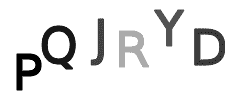

# PHP 中的音频验证码

> 原文：<http://web.archive.org/web/20220810161336/https://imrannazar.com/Audio-Captchas-in-PHP>

基于验证码的提交验证系统最常提到的问题之一是缺少可访问的选项；不能提供纯文本的替代方案，原因很简单，它提供了一个绕过验证码的简单途径，从而挫败了建立这样一个系统的目的。

找出验证码图像显示什么的任何替代手段必须对于不能查看图像的人是可访问的，同时也给自动和垃圾邮件提交带来一定程度的困难；满足这两个标准的选项是音频验证码。

### 这个概念

音频验证码背后的想法很简单:除了在屏幕上提供验证码图像，还提供了代表图像的声音文件。这迎合了大多数用户的需要，否则他们将无法输入验证码文本。这个声音文件可以是一个简单的 RIFF wave 文件，但更常见的是编码成语音编解码器或普遍存在的 MP3 格式。

在本文中，我将研究一个简单的 MP3 音频 Captcha 的实现，它采用几个字符的短字符串并创建一个声音文件。对于本文，我假设它只由小写字母组成；没有数字或大写字母，也没有标点符号，为了让事情保持在最低水平。音频验证码算法基于一系列声音文件，每个文件代表一个字母，然后可以连接成一个完整的字符串。

 *Figure 1: The concatenation algorithm*

在理想的情况下，通过一个接一个地写出文件的内容，将每个文件的内容合并到一个大文件中是很简单的。这将是一个微不足道的连接过程，但不幸的是不会工作。出于这个原因，了解一下 RIFF wave 文件的组成是很重要的。

### RIFF 文件格式

RIFF wave 文件不仅仅是数字化波形的基本记录；除了波形数据之外，还附加了关于数据大小及其来源的元数据。

| 字节 1 | 字节 2 | 字节 3 | 字节 4 |
| 块标题:“RIFF” |
| RIFF 块大小(文件大小-8) |
| 块标题:“WAVE” |
| **子块头:“fmt”** |
| 格式化块大小 |
| 格式(1=PCM) | 频道计数 |
| 采样率(赫兹) |
| 每秒字节数 |
| 块对齐值 | 每样本位数 |
| **子块头:“数据”** |
| 数据量 |
| 文件数据 |

*Table 1: RIFF wave file format*

上表显示了最简单的 RIFF wave 文件的格式。这种格式能够保存用于 MIDI 采样器的波形文件的信息、混音的提示点以及各种其他附加信息；大多数 wave 文件不包含这些，只是一个附有标题的波形数据记录。

可以看出，wave 文件不仅指定了数字化波形的长度，还指定了其采样速率和通道数。一个电话级别的 wave 文件可以很容易地从 CD 质量的文件中区分出来，只要简单地检查一下采样率；以类似的方式，可以区分立体声波形文件和单视场文件。提供关于文件的元数据是附加头的原因，因为否则声音播放器应用程序将不知道播放声音文件的过程。

不幸的是，这意味着两个 RIFF 文件的简单连接不会产生更长的 RIFF 文件。声音播放器将读取文件开头的头，它指示要连接的第一段的长度，并播放该段；在这一点上，一个合理的播放器将推断已经到达文件的结尾，因为它的播放样本的记录与文件头中指示的数字相同，并且不会再播放文件的任何部分。

这个问题的解决方案是使用一个更复杂的连接:不是简单地把文件扔在一起，而是需要通过一个外部声音处理器来运行。

### 外部声音处理器

`sox`命令是一个音频连接和处理工具的简单接口，可以用于这个音频验证码。如果将每个字母的 wave 文件传递到 sox 中，则可以输出一个包含所有输入文件的 wave 文件，并带有一个包含总数据大小和总采样率的更新格式头。调用示例如下所示:

#### sox 的调用:一个示例串联

```
sox a.wav x.wav m.wav b.wav -t .wav axmb.wav
```

由于每个字母都包含在自己的 wave 文件中，所以分解验证码文本字符串并构建一个命令行供`sox`使用是一件小事。以下示例假设 Captcha 脚本是用 PHP 编写的，文本在生成后保存在会话数据中。

#### 构建连接的波形文件

```
$parts = array();
for($i = 0; $i < strlen($_SESSION['captcha']); $i++)
    $parts[] = $_SESSION['captcha'][$i] . '.wav';

exec(sprintf('sox %s -t .wav %s.wav', join(' ', $parts), $_SESSION['captcha']));
```

这不会生成一个代表验证码文本的 MP3 为此，需要一个 MP3 编码器。允许以不同的采样率对 MP3 进行编码，但通常会从输入文件中获取采样信息。如上所述，由于 wave 文件包含关于采样和格式化的详细信息，`lame`能够使用它来生成 MP3 文件。

下面的例子是对上面的`sox`调用的一个小小的修改，目的是将输出传送到`lame`并编码一个 MP3 文件，然后将 MP3 作为一个可下载的文件发送出去。

#### 构建 Captcha MP3

```
$parts = array();
$c = $_SESSION['captcha'];
for($i = 0; $i < strlen($c); $i++)
    $parts[] = $c[$i] . '.wav';

exec(sprintf('sox %s -t .wav - | lame - %s.mp3', join(' ', $parts), $c));

header('Content-type: audio/mpeg');
header('Content-length: '.filesize("{$c}.mp3"));
header('Content-disposition: attachment; name="'.$c.'.mp3"');
passthru("{$c}.mp3");
```

这个脚本在验证码中的用法示例如下。

 [](/web/20220810161352/https://imrannazar.com/content/img/audio-captcha-pqjryd.mp3) *Figure 2: Example Captcha with audio download option*

### 可能的增强

在上面的例子中，清晰发声的短语被用于音频 Captcha 的组成字母。这提供了很好的可访问性，但是损害了音频 Captcha 的安全性:任何自动规避都可以很容易地找出组成音频文件的字母。对此的一个解决方案是在音频文件上叠加一定程度的噪声，为输出提供一定程度的模糊；除此之外，可以在字母波形之间插入静默期，使输出不那么规则。

可以对音频验证码输出进行的另一个增强是为文件提供更多格式。目前，音频验证码以 RIFF wave 和 MP3 格式生成；提供 Windows 音频和 Ogg 格式将允许输出文件的更广泛使用。

tf@imrannazar.comT5，2010 年 1 月。

*文章日期:2010 年 1 月 9 日*