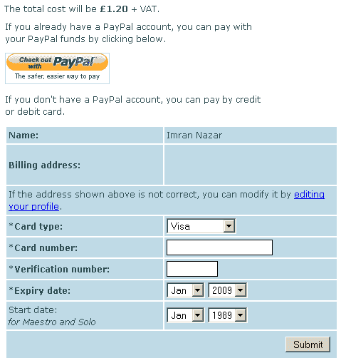
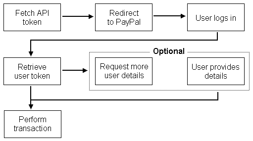

# 实施 PayPal 网站支付 Pro UK

> 原文：<http://web.archive.org/web/20220810161336/https://imrannazar.com/Implementing-PayPal-Website-Payments-Pro-UK>

网站收取商品和服务费用的最流行方式之一是通过在线支付服务 PayPal。特别是，它可以直接通过贝宝认证信用卡和借记卡，而无需客户拥有贝宝账户；这项服务被称为专业网站支付。

在英国，Website Payments Pro 被实现为 REST 或 SOAP API，网站可以连接到该 API 并请求交易。然而，实现这些请求有一些陷阱:

Inadequate documentation:

PayPal provide at least three conflicting versions of the documentation for the API, each covering a different revision of the API itself; none are marked as current relative to the others, and the API as used in production incorporates elements of each. As such, it can be difficult to produce a working API request.

The sandbox:

A "sandbox" environment is provided for testing of API requests before they are used to process live transactions. The principle is well thought-out, but the sandbox has issues: it provides a different revision of the service to the live process, and the server hosting the sandbox is often unresponsive. This makes it, at best, time-consuming to use the sandbox.

Two transaction methods:

In order to provide the ability to process credit or debit cards directly (referred to as Direct Payment), PayPal stipulate that a three-step process called Express Checkout also be available for PayPal users without a card to hand. The matter of maintaining state within an Express Checkout transaction can be troublesome, and the process must be kept distinct and separate from Direct Payments.

在实现 WPP 时，我陷入了以上所有的陷阱，所以我写了下面这篇文章，以供参考，并作为实现网站支付专业版的一个连贯的文档来源。请注意，自始至终，使用的 API 修订版是 56.0，将使用 REST 调用。

### 基础知识:API 调用

PayPal REST API 是通过向一个安全的(HTTPS) URI 发送一个请求来调用的，这个请求的凭证是由一个“商业”PayPal 帐户的持有者生成的。凭证由基于帐户持有人的电子邮件地址的 API“用户”、凭证密码和被 API 用作附加校验和的编码“签名”组成。一组凭据示例如下所示:

#### API 凭证(示例):

```
USER:       tf_api1.imrannazar.com
PWD:        QF63NP99NPER3V7A
SIGNATURE:  AZM6n0EcNmR0AQYsCf0s1VrwkV10AlKArJ7a8X4YHG-R2oFkOwGqVrJZ
VERSION:    56.0
```

这些变量与事务请求参数一起在标准的后格式化查询中传递给前面提到的 HTTPS·URI。API 将返回一个带有事务请求结果的后格式化字符串，该字符串可以手动拆分，也可以使用脚本语言的内置函数进行拆分。本文中的例子是用 PHP 编写的，它提供了构建和分解后格式化字符串的函数。下面的代码将产生并向 PayPal API 发送一个请求，解析并返回结果。

#### PHP cURL 代码来调用 PayPal API

```
class PaymentPaypal
{
    const API_URI = 'https://api-3t.paypal.com/nvp';

    // PayPal API credential configuration
    private $config;

    // Data for this transaction (cart ID/contents/amount)
    private $data;

    function send($params)
    {
	$params['USER']      = $this->config['USER'];
	$params['PWD']       = $this->config['PWD'];
	$params['SIGNATURE'] = $this->config['SIGNATURE'];
	$params['VERSION']   = '56.0';

	// Fire up a POST request to PayPal
	$c = curl_init();
	curl_setopt_array($c, array(
	    CURLOPT_URL            => self::API_URI,
	    CURLOPT_FAILONERROR    => true,
	    CURLOPT_RETURNTRANSFER => true,
	    CURLOPT_FOLLOWLOCATION => true,
	    CURLOPT_POST           => true,
	    CURLOPT_POSTFIELDS     => http_build_query($params)
	));

	$result = curl_exec($c);

	if(!$result)
	{
	    // Request failed at HTTP time; return the cURL error
	    return array('ERROR' => curl_error($c));
	}
	else
	{
	    // Request returned; break out the response into an array
	    curl_close($c):
	    $r = array();
	    parse_str($result, $r);
	    return $r;
	}
    }
}
```

这个类的`config`成员变量可以在构造时填充，这里不显示它的处理。

### 错误处理

如上所示，如果 PayPal 拒绝正确响应，可以进行初步捕捉，因为 cURL 在这种情况下会产生错误。然而，如果请求成功，但 PayPal 返回一个错误，这些错误也必须加以考虑。PayPal 允许通过发送错误信息和适当的回复来实现这一点。

如果响应中提供了任何错误消息，它们将以三种格式提供:

*   **`L_ERRORCODEx`** :参照 [PayPal 错误代码和信息列表](http://web.archive.org/web/20220810161352/https://www.paypal.com/en_US/ebook/PP_APIReference/Appx-ErrorCodes_and_Messages.html)的错误代码；
*   **`L_SHORTMESSAGEx`** :错误的简短技术描述；
*   **`L_LONGMESSAGEx`** :可以直接打印给用户的长描述。

PayPal 建议，如果在您捕获错误时向用户打印消息，应该是长消息，因为短消息可能难以理解。这种情况的一个例子是错误代码`10537`，“风险控制国家过滤器故障”。这方面的长消息目前被记录为:“交易被拒绝，因为该国家因您的国家监控风险控制设置而被禁止”，这显然比短消息或错误代码本身更容易理解。

由于 PayPal 交易可能会导致多个错误，因此每组错误代码和消息都带有一个数字后缀，即上面的“x”。数字从 0 开始，这意味着 API 调用中的任何失败通常都记录在响应的`L_LONGMESSAGE0`部分。如果`L_LONGMESSAGE0`没有充分解释错误的原因，您的代码可以检查任何其他可能出现的错误。

### 请求前:用户输入

如前所述，PayPal 允许网站支付专业版的用户使用快速结账(EC)或直接支付(DP)来验证交易。为了提供选择，并在使用 DP 时记录信用卡的详细信息，必须向用户提供一个表格，说明要支付的金额，并显示两种方法。

PayPal 对此输入表格规定了以下要求:

*   该表单必须向用户说明该交易的费用(要支付的金额)。
*   必须提供一个“快速结帐”按钮，这将启动电子商务进程。
*   如果网站要使用 DP，必须提供一份记录信用卡详细信息的表格，该表格必须向 PayPal 提供帐单名称和地址以及卡的详细信息。

您可以随意填写表格，账单名称和地址可以事先从之前注册的账户中获取，或者直接在 DP 表格中提供卡的详细信息。下面是一个例子。

 *Figure 1: Payment input form*

### 快速结账

快速结账流程分为三个阶段，允许用户登录 PayPal 并使用其账户余额支付交易。一旦他们登录，如果网站需要，他们可以确认他们的信息，如送货地址，然后交易通过 API 发送到 PayPal 帐户。

 *Figure 2: Express Checkout process*

第一步，在文档中称为`SetExpressCheckout`,是生成一个交易“令牌”,允许您的网站和 PayPal 跟踪这三个步骤:这是通过 API 调用 PayPal 并请求 EC 令牌来完成的。令牌生成后，用户将被转发到 PayPal，以便他们可以登录，然后 PayPal 会将用户返回到您的网站。

| Req/Ret | 名字 | 价值 |
| --- | --- | --- |
| *请求* | tuxtype | **S** |
| *请求* | 行为 | **S** |
| *请求* | 选择性最低税 | 交易金额 |
| *请求* | 货币代码 | 交易货币(**英镑**) |
| *请求* | RETURNURL | PayPal 第二阶段的网址 |
| *请求* | 取消 | 如果取消，PayPal 将转到的 URL |
| **返回** | 命令正确应答 | **成功**或**失败** |
| **返回** | 代币 | 生成的令牌 |

*Table 1: API parameters for Express Checkout stage 1*

如果 API 返回带有“失败”的`ACK`值，则该返回将不包含`TOKEN`；这可用于检查令牌请求是否成功。

阶段 1 请求的 URL 参数允许网站知道用户是否已经进行到步骤 2，或者已经在 PayPal 端取消交易。通过这些 URL 传递交易信息(如 ID ),网站可以得到通知并采取适当的行动，如在触发`CANCELURL`时将交易标记为“已取消”。下面为此目的显示的 URL 链接到一个虚构的路由框架，但它们可以修改以匹配您的配置。

#### 快速结账阶段 1 的请求代码

```
class PaymentPaypal
{
    function express_stg1()
    {
        $params = array(
	    'TRXTYPE'      => 'S',
	    'ACTION'       => 'S',
	    'AMT'          => $this->data['transaction_amount'],
	    'CURRENCYCODE' => 'GBP',
	    'RETURNURL'    =>' ($this->config['SITEBASE'].'/checkout/ec2/'.$this->data['transaction_id']),
	    'CANCELURL'    => ($this->config['SITEBASE'].'/checkout/cancel/'.$this->data['transaction_id'])
	);

	$response = $this->send($params);

	if($response['ACK'] == 'Failure' || !isset($response['TOKEN']))
	{
	    // Request failed; return error
	    return array(
	    	'status' => 'FAIL',
		'msg' => $response['L_LONGMESSAGE0']
	    );
	}
	else
	{
	    // Request successful; forward user to PayPal and end script
	    header('Location: https://www.paypal.com/cgi-bin/webscr?cmd=_express-checkout&token='.$response['TOKEN']);
	    die('FORWARD');
	}
    }
}
```

一旦用户登录 PayPal 并返回到您的网站，PayPal 允许通过名为`GetExpressCheckout`的步骤检索令牌并进一步重定向以输入送货地址和相关详细信息。如果您的网站无法将帐单和送货地址与给定用户的个人资料联系起来，这可能是有利的，但 PayPal 表示，如果这些细节已经在您网站上的个人资料中，则可以跳过这第二步。我发现直接处理这些资料比再次通过 PayPal 转发更简单，所以快速结账的第 2 阶段只是一个将用户带到第 3 阶段的按钮。当然，这可以实现为使用阶段 1 调用的`RETURNURL`参数直接链接到阶段 3。

无论采用哪种实现方式，返回到的 URL 都将在 GET 行上提供两个参数:在阶段 1 中生成的原始 EC 令牌，以及对应于用户登录 PayPal 的`PayerID`。快速结账的第三个阶段是`DoExpressCheckout`，它使用 PayPal 用户提供的认证令牌，通过 API 执行交易的实际工作，并使用这两个令牌作为 API 调用的参数。

| Req/Ret | 名字 | 价值 |
| --- | --- | --- |
| *请求* | tuxtype | **S** |
| *请求* | 行为 | **D** |
| *请求* | 选择性最低税 | 交易金额 |
| *请求* | 货币代码 | 交易货币(**英镑**) |
| *请求* | 代币 | 阶段 1 中生成的 EC 令牌 |
| *请求* | 佩耶里德 | PayerID 回到了第二阶段 |
| *请求* | 支付行为 | **销售**或**授权** |
| **返回** | 结果 | 0 表示成功，正表示通信错误，负表示拒绝 |
| **返回** | RESPMSG | EC 结果的简短描述 |

*Table 2: API parameters for Express Checkout stage 3*

这里唯一的新参数是`PAYMENTACTION`；这使得 PayPal 帐户可以在不进行完整销售的情况下进行授权检查，这对于测试目的以及重复计费和发票等高级目的非常有用。快速结账的这些特性超出了本文的范围，但是 PayPal 提供了一个描述电子商务集成的 [PDF 文件](http://web.archive.org/web/20220810161352/https://cms.paypal.com/cms_content/US/en_US/files/developer/PP_WebsitePaymentsPro_IntegrationGuide_UK.pdf),详细介绍了这些特性。(但是，请注意，该文档在描述 API 请求的基本发送方面已经过时；本文中描述的方法更加通用。)目前，将它设置为`Sale`并每次请求一个完整的事务就足够了。

除了检查 PayPal 响应的标准错误代码之外，谨慎的做法是检查第三阶段调用的`RESULT`，以确保它作为成功的交易返回(零)。如果设置了另一个值，`RESPMSG`将描述交易发生了什么，比如“拒绝”。

#### 快速结账阶段 3 的请求代码

```
class PaymentPaypal
{
    function express_stg3($token, $payerid)
    {
        $params = array(
	    'TRXTYPE'       => 'S',
	    'ACTION'        => 'D',
	    'AMT'           => $this->data['transaction_amount'],
	    'CURRENCYCODE'  => 'GBP',
	    'TOKEN'         => $token,
	    'PAYERID'       => $payerid,
	    'PAYMENTACTION' => 'Sale'
	);

	$response = $this->send($params);

	if(isset($response['L_ERRORCODE0']) || $response['RESULT'] != 0 || !isset($response['TOKEN']))
	{
	    return array(
	        'status' => 'FAIL',
		'msg' => $response['RESPMSG']
	    );
	}
	else
	{
	    return array(
	        'status' => 'PASS',
		'msg' => 'Transaction complete'
	    );
	}
    }
}
```

### 直接付款

快速结账的替代方式是直接支付，即直接从信用卡或借记卡中扣款，无需用户注册贝宝。DP 获取一组卡的详细信息，以及账单名称和地址，并通过 PayPal 发送它们；响应要么是对卡成功收费，要么是失败，原因有很多:账单名称不匹配、卡号无效等等。因为 DP 需要大量的信息，所以下面的所有请求字段都是必填的，除非另有标记。

| Req/Ret | 名字 | 价值 |
| --- | --- | --- |
| *交易明细* |
| *请求* | TRXTYPE | **S** |
| *请求* | 温柔的 | **C** |
| *请求* | 选择性最低税 | 交易金额 |
| *请求* | 货币代码 | 交易货币(**英镑**) |
| *请求* | 方法 | **直接付款** |
| *请求* | 支付行为 | **销售** |
| *请求* | IP 地址；网络地址 | 用户的远程 IP |
| *卡片详细信息* |
| *请求* | 信用卡类型 | 卡的种类
( **Visa** 、 **MasterCard** 、 **Amex** 、 **Maestro** 、 **Solo** ) |
| *请求* | 激活凝固时间 | 卡号(12-20 位数字) |
| *请求* | 失效期 | 到期日期(年，月是 01-12) |
| *请求* | STARTDATE | 开始日期(MMYYYY，月为 01-12)
*仅 Maestro 和 Solo 卡需要* |
| *请求* | CVV2 | 卡安全码(3-6 位数字) |
| *请求* | 西方人名的第一个字 | 持卡人姓名 |
| *请求* | 姓 | 持卡人的姓氏 |
| *请求* | 街道 | 账单门牌号/名称和街道 |
| *请求* | 街道 2 | [可选]第二个帐单地址行 |
| *请求* | 城市 | 帐单地址城镇/城市 |
| *请求* | 活力 | 帐单地址邮政编码 |
| *请求* | 国家代码 | 发卡国家( **GB** ) |
| **返回** |
| **返回** | 命令正确应答 | **成功**或**失败** |
| **返回** | 交易 id | PayPal 提供的字母数字标识 |
| **返回** | 时间戳 | ISO 格式的交易时间和日期 |
| **返回** | 选择性最低税 | 交易金额 |
| **返回** | 货币代码 | 交易货币(**英镑**) |

*Table 3: API parameters for Direct Payment*

当您发送卡片进行处理时，PayPal 将要求地址和 CVV 与卡片匹配；这些匹配的结果将与上述其他参数一起作为`AVSADDR`、`AVSZIP`和`CVV2MATCH`响应值在响应中提供。其中每一个都将具有以下字符之一作为其值:

*   **Y** :值与银行持有的值匹配；
*   **N** :检查数值发现不正确；
*   **X** :未检查数值。

如果这些失败，PayPal 不会拒绝交易，但你可以记录这些交易的价值，以防发生任何情况。与快速结帐一样，重要的标志是`ACK`；这将指示充电是否成功。

#### 直接付款的请求代码

```
class PaymentPayPal
{
    function direct($cc)
    {
        $params = array(
	    'TRXTYPE'        => 'S',
	    'TENDER'         => 'C',
	    'AMT'            => $this->data['transaction_amount'],
	    'CURRENCYCODE'   => 'GBP',
	    'METHOD'         => 'DoDirectPayment',
	    'PAYMENTACTION'  => 'Sale',
	    'IPADDRESS'      => $_SERVER['REMOTE_ADDR'],

	    'CREDITCARDTYPE' => $cc['type'],
	    'ACCT'           => $cc['number'],
	    'EXPDATE'        => sprintf('%02d%04d', $cc['expmonth'], $cc['expyear'],
	    'CVV2'           => $cc['cvv']
	    'FIRSTNAME'      => $this->data['user_fname'],
	    'LASTNAME'       => $this->data['user_sname'],
	    'STREET'         => $this->data['user_adstreet'],
	    'CITY'           => $this->data['user_adtown'],
	    'ZIP'            => $this->data['user_adpostcode'],
	    'COUNTRYCODE'    => 'GB',
	);

	// Fill in the start date if required
	if($cc['type'] == 'Maestro' || $cc['type'] == 'Solo')
	{
	    $params['STARTDATE'] = sprintf('%02d%04d', $cc['startmonth'], $cc['startyear']);
	}

	$response = $this->send($params);

	if(isset($response['L_ERRORCODE0']) || $response['ACK'] == 'Failure')
	{
	    return array(
	        'status' => 'FAIL',
		'msg' => $response['L_LONGMESSAGE0']
	    );
	}
	else
	{
	    return array(
	        'status' => 'PASS',
		'msg' => 'Transaction complete'
	    );
	}
    }
}
```

### 解决纷争

使用上述程序时可能会出现一些问题；下面是我遇到的一些最常见的例子。

Direct Payment transactions fail on small amounts of money:

PayPal will only accept a credit or debit card for charging if the transaction is more than £1.00; it's for this reason that the cost of the test transaction in Figure 1 is £1.20, to get over this hurdle and allow PayPal to process the transaction.

PayPal returns an "invalid merchant configuration" on Direct Payment:

This most often comes up if the PayPal account holder has upgraded their account to Website Payments Pro, and then not paid the monthly £20.00 fee; if this fee isn't paid, the Pro functionality and API access will be suspended, and the routines above won't have any valid credentials to connect with.

### 最后

要通过 PayPal 网站 Payments Pro 发送交易，这几乎是您需要知道的全部内容。我还没有涉及更高级的方面，比如经常性的账单和退款，但是这些只不过是不同的`TRXTYPE`而已，并且在 PayPal 自己的文档中有充分的记录。请注意，在 API 的不同版本之间，身份验证方法已经发生了变化:如果文档要求您发送一个`VENDOR`值，您可以安全地忽略它。

tf@imrannazar.com2009 年 9 月

*文章日期:2009 年 9 月 15 日*