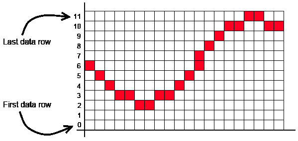

# brain fuck 隐写术

> 原文：<http://web.archive.org/web/20220810161336/https://imrannazar.com/Steganography-with-Brainfuck>

隐写术是一组技术的名称，其中目标消息隐藏在其他数据中，最常见的是以某种形式在图像的上下文中。常见的隐写术形式包括单个像素级别的偏差，或者图像低级别噪声成分的变化。在本文中，我将介绍一种生成图像的技术，这种图像也是一个程序，可以运行它来生成有针对性的消息。

为了使这里的例子简单，我寻找了一种具有简单指令集的程序形式。许多处理器有一个简单的指令集:6502 在其架构中有大约 150 个独特的代码，通过仔细选择指令可以进一步减少。然而，在之前已经有了关于 Brainfuck 的[，这似乎是一个合乎逻辑的选择:八条指令，每条指令都有一个唯一的代码，所有其他代码在执行过程中都会被忽略。](/web/20220810161354/https://imrannazar.com/Trainfuck)

要编码的程序如下:

#### 编码前的消息

```
>>++++++++[<+++[<+++++>-]>-]<<[>+>+>+>+>+<<<<<-]++++++++[>->-->
--->---->-----<<<<<-]<++++[>++++++++<-]>>>>>>++++.<<<.>+++++.<<
<.>>+++++.++.-.---.>.<<+++++++++.<.>>--.<------.<.>>.+++++.<<.>
+.>------.>.<<<.>>>-.<+.<-.>-.<++++.>>---.<<----.>.>++++.<<-.

The monkey is in the dishwasher
```

### 将程序代码编码成像素

为了将程序转换成图像，第一步是将程序视为一串数字。在 Brainfuck 中，这八个操作符可以被视为要插入到流中的八个数字:

| + | 0x2B | - | 0x2D |
| [ | 0x5B | ] | 0x5D |
| < | 0x3C | > | 0x3E |
| 。 | 0x2E | , | 0x2C |

*Table 1: Character values for the Brainfuck operators*

如果数据是全色的(24 位或 32 位),那么在图像数据中隐藏这些值将是困难的，因为颜色分量需要精确地对应于图像中的给定点。使用基于调色板的图像比使用全色图像更有意义，其中 8 位调色板索引指的是预先定义的颜色表。

调色板数据的一个简单示例是 16 种色调的分级灰度图像，如下所示:

 *Figure 1: Lena, in sixteen-shade greyscale*

如果该图像是以标准方式生成的，则图像旁边会保存 16 个条目和 240 个空白的调色板。通过将调色板条目扩展到分配的最大数量 256，可以使用额外的条目来隐藏信息:

|  | Zero | one | Two | three | four | five | six | seven | eight | nine | A | B | C | D | E | F |
| Zero |  |  |  |  |  |  |  |  |  |  |  |  |  |  |  |  |
| one |  |  |  |  |  |  |  |  |  |  |  |  |  |  |  |  |
| Two |  |  |  |  |  |  |  |  |  |  |  | + | , | - | 。 |  |
| three |  |  |  |  |  |  |  |  |  |  |  |  | < |  | > |  |
| four |  |  |  |  |  |  |  |  |  |  |  |  |  |  |  |  |
| five |  |  |  |  |  |  |  |  |  |  |  | [ |  | ] |  |  |
| six |  |  |  |  |  |  |  |  |  |  |  |  |  |  |  |  |
| seven |  |  |  |  |  |  |  |  |  |  |  |  |  |  |  |  |
| eight |  |  |  |  |  |  |  |  |  |  |  |  |  |  |  |  |
| nine |  |  |  |  |  |  |  |  |  |  |  |  |  |  |  |  |
| A |  |  |  |  |  |  |  |  |  |  |  |  |  |  |  |  |
| B |  |  |  |  |  |  |  |  |  |  |  |  |  |  |  |  |
| C |  |  |  |  |  |  |  |  |  |  |  |  |  |  |  |  |
| D |  |  |  |  |  |  |  |  |  |  |  |  |  |  |  |  |
| E |  |  |  |  |  |  |  |  |  |  |  |  |  |  |  |  |
| F |  |  |  |  |  |  |  |  |  |  |  |  |  |  |  |  |

*Table 2: Sixteen-shade greyscale palette, with Brainfuck operators indicated*

从上面可以看出，调色板的每一行都是相同的灰色，除了 Brainfuck 操作符映射到调色板的地方。通过改变图像中的任意像素，可以用例如一个`+`操作符替换任何给定的# 2-灰色像素，而不改变所用调色板的行。以这种方式沿着调色板行移动像素值允许我们在不改变图像外观的情况下改变值。

在将这一概念应用于图 1 中的示例图像之前，重要的是要考虑这样做所需的图像类型。

### 未压缩图像:BMP 格式

图像格式带来的主要问题是压缩:为了使图像文件更小，可以使用各种压缩方法将图像中的相似区域转换成比原始图像所表示的数据量小得多的数据量。当然，当这样做时，所得到的压缩数据与原始图像数据没有表面关系；试图将 Brainfuck 程序编码到压缩数据流中超出了本文的范围。

相反，我将专注于原始图像数据本身；原始数据的存储可以通过未压缩的数据格式如 TIFF 来实现。未压缩的 8 位调色板图像格式的例子包括 BMP 和 PCX；这里将使用前者，因为它是主要的图像文件格式。当用作未压缩的 8 位格式时，BMP 文件的结构如下:

| 田 | 大小(字节) | 价值 |
| 签名 | Two | “BM” |
| 文件大小 | four | 完整 BMP 的大小 |
| 内向的; 寡言少语的; 矜持的 | four | 0x00000000 |
| 数据偏移 | four | 像素阵列的偏移量 |
| BITMAPINFOHEADER |
| 页眉尺寸 | four | 0x00000028 |
| 图像宽度 | four | 以像素为单位的图像宽度 |
| 图像高度 | four | 图像的高度，以像素为单位 |
| 彩色飞机 | Two | 0x0001 |
| 颜色深度 | Two | 0x0008 |
| 压缩法 | four | 0x00000000 |
| 未压缩图像大小 | four | 宽度*高度*每像素字节数 |
| 水平 DPM | four | 每米像素，水平 |
| 垂直 DPM | four | 每米像素，垂直 |
| 使用的颜色 | four | 独特颜色的数量 |
| 重要的颜色 | four | 重要颜色的数量 |
| 颜色表(256 个条目) |
| 颜色 | four | RGBA 值 |
| 像素数据，每像素 1 字节 |

*Table 3: BMP file structure (all numeric fields are little-endian)*

这个过程的最终结果是产生一个可以作为 Brainfuck 程序运行的位图文件；为此，我们必须小心，标题数据和颜色表不包含可能破坏程序初始状态的 Brainfuck 操作符。幸运的是，这相对容易:所需要的只是选择一个在字节值中不包含操作符的图像宽度和高度，其余的应该会自动就位。

BMP 格式的另一个奇怪之处是像素数据的存储顺序。根据计算机图形学原理，大多数图像格式将第一行视为顶行；BMP 按照数学图形原理排列，将最下面一行作为第一行。

 *Figure 2: Position of the rows in a BMP*

这意味着 Brainfuck 操作符需要编码到图像中，从底部开始，从左到右运行，然后向上移动到下一行。通过依次检查程序中的每个操作符，并找到下一个合适的像素(调色板中同一行的像素)进行替换，可以获得以下结果。

 *Figure 3: Lena, encoded with the targeted message, at 400% zoom*

一旦适当的像素被替换为沿着调色板行移动的版本，调色板可以被修改以将 Brainfuck 操作符设置为与它们所在的行的其余部分相同的颜色。这样做，并产生结果的未压缩位图，提供了以下内容。

 *Figure 4: The original image, and the image encoded with the target message*

通过 Brainfuck 解释器运行位图图像(如右图所示),可以显示目标信息。

#### PHP Brainfuck 解释器

```
<?php
list($c, $i) = split('!', file_get_contents($_SERVER['argv'][1]));
$c = preg_replace('#[^\[\]\<\>,.+-]#', "", $c);
$p = $v = 0;
eval(strtr($c, array(
    "]" => "}",
    "[" => 'while($m[$p]){',
    "+" => '$m[$p]++;',
    "-" => '$m[$p]--;',
    ">" => '$p++;',
    "<" => '$p--;',
    "," => 'if(strlen($i)>$v)$m[$p]=ord($i[$v++]);',
    "." => 'echo chr($m[$p]);'
)));
?>
```

#### 样本结果

```
$ php -f brainfuck.php http://imrannazar.com/content/img/bf-bmp-final.bmp
The monkey is in the dishwasher$
```

### 警告和改进

上面概述的过程非常简单，可以自动化:给定一个 16 级灰度图像，从左下方寻找所需调色板行中的像素，替换该像素并向前移动。然而，这对于隐写术来说并不理想；Brainfuck 运算符在一个位图中留下了一个独特的签名，该位图原本是统一的数字。有两种简单的方法可以提高模糊处理的级别:

*   **颜色**:不使用灰度图像，这提供了简单的颜色匹配，可以使用任何 8 位图像作为源的彩色调色板。这包括用接近的颜色匹配替换任何现有的操作符实例，然后进一步的颜色匹配可以用于填充程序，将信号隐藏在增加的噪声水平中。
*   **压缩**:一旦图像被编码，通过压缩图像可以进一步增加噪声水平，隐藏位图数据和包含在其中的任何 Brainfuck 程序之间的任何关系。这增加了编码和解码算法的复杂性，因为在图像传输过程中必须采用压缩步骤，但它允许以避免怀疑的格式传输图像。

2011 年 11 月，伊姆兰·纳扎尔<>。

*文章日期:2011 年 11 月 12 日*