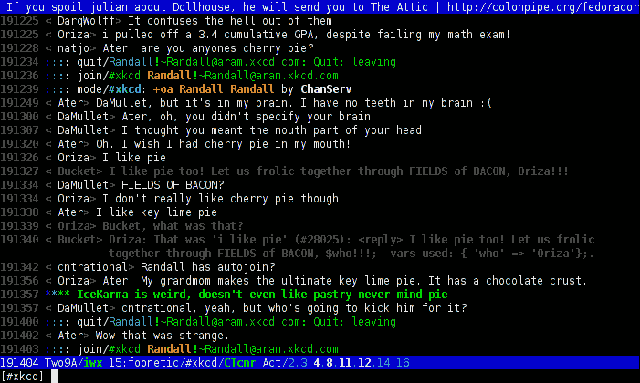

# Line color . pl:irssi 中基于规则的线条着色

> 原文：<http://web.archive.org/web/20220810161336/https://imrannazar.com/linecolor.pl:-Rule-based-Line-Coloring-in-irssi>

任何 IRC 用户都会告诉你，`ignore`命令是上帝的礼物:它允许你忽略任何由特定的人或昵称产生的输出，无论是普通的噪音还是完全恶意的东西。在`irssi`客户机中，您可以更进一步，为任何匹配给定正则表达式的消息指定 ignore，不管它们来自哪个 nick。

在某些情况下，你可能不希望完全忽略一个人；他们可能偶尔会对某个话题有所洞察，但在一天的大部分时间里只是愚蠢地行事。或者，一个特别健谈的机器人可能有一些有用的功能，但大多数时候只会妨碍频道讨论。在这种情况下，需要一个介于完全参与和完全无知之间的中间站。

### 线条着色

如果某个 IRC 客户端的频道窗口有一个标准的高对比度配色方案(要么是黑底白字，要么是黑底白字)，那么定义一个完全可见的文本和完全隐藏的文本之间的中间点(灰色文本)就很简单了。类似地，例如，任何需要特别注意的文本行都可以用红色突出显示。需要一种方法来表示值得注意的行和可以半忽略的行。

对于`irssi`客户端来说，`nickcolor`扩展非常接近:它能够为给定的缺口指定一种特定的颜色，并以随机的颜色突出显示其余的部分。不幸的是，目前的`nickcolor`有一些缺点:

*   只有刻痕是彩色的，线条保持正常颜色；这对我们的目的来说是不够的。
*   除了需要的刻痕之外，其他刻痕被着色；理想情况下，它们应该保持正常状态。
*   顾名思义，`nickcolor`只用昵称作品；它不能为了突出显示而对邮件应用正则表达式匹配。

为了解决这些问题，一个适应版本的`nickcolor is put forward in this article, which I've renamed as `linecolor`。其用法示例如下。`

#### `linecolor`:样本使用

```
/color set Bucket 14
/color rset ^Bucket 14
```

上述规则规定,“Bucket”的任何输出都要标记为颜色#14(灰色),以单词“Bucket”开头的任何缺口的任何输出也要标记为灰色。结果输出如下所示。

 *Figure 1: Colouring IRC lines for half-ignore*

代码如下所示，也可从[http://imrannazar.com/content/img/linecolor.txt](/web/20220810161354/https://imrannazar.com/content/img/linecolor.txt)获得。

#### `linecolor`:用于基于规则的线条着色的 irssi 脚本

```
# Line Color - Assign colours to lines from specific nicks, or matching patterns
# Adapted from "Nick Color" by Timo Sirainen, as modified by Ian Petersi

use strict;
use Irssi 20020101.0250 ();
use vars qw($VERSION %IRSSI); 
$VERSION = "1.2";
%IRSSI = (
    authors     => "Timo Sirainen, Ian Petersi, Imran Nazar",
    contact	=> "tss\@iki.fi", 
    name        => "Line Color",
    description => "assign colours to lines through nick/regex rules",
    license	=> "Public Domain",
    url		=> "http://irssi.org/",
    changed	=> "2010-01-28T18:30+0000"
);

# hm.. i should make it possible to use the existing one..
Irssi::theme_register([
  'pubmsg_hilight', '{pubmsghinick $0 $3 $1}$2'
]);

my %saved_colors;
my %saved_regex_colors;
my %session_colors = {};
my @colors = qw/2 3 4 5 6 7 9 10 11 12 13/;

sub load_colors {
  open COLORS, "$ENV{HOME}/.irssi/saved_colors";

  while (<COLORS>) {
    # I don't know why this is necessary only inside of irssi
    my @lines = split "\n";
    foreach my $line (@lines) {
      my($type, $nick, $color) = split ":", $line;
      if ($type eq "NICK") {
        $saved_colors{$nick} = $color;
      } elsif ($type eq "REGEX") {
        $saved_regex_colors{$nick} = $color;
      }
    }
  }

  close COLORS;
}

sub save_colors {
  open COLORS, ">$ENV{HOME}/.irssi/saved_colors";

  foreach my $nick (keys %saved_colors) {
    print COLORS "NICK:$nick:$saved_colors{$nick}\n";
  }
  foreach my $regex (keys %saved_regex_colors) {
    print COLORS "REGEX:$regex:$saved_regex_colors{$regex}\n";
  }
  Irssi::print("Saved colors to $ENV{HOME}/.irssi/saved_colors");

  close COLORS;
}

# If someone we've colored (either through the saved colors, or the hash
# function) changes their nick, we'd like to keep the same color associated
# with them (but only in the session_colors, ie a temporary mapping).

sub sig_nick {
  my ($server, $newnick, $nick, $address) = @_;
  my $color;

  $newnick = substr ($newnick, 1) if ($newnick =~ /^:/);

  if ($color = $saved_colors{$nick}) {
    $session_colors{$newnick} = $color;
  } elsif ($color = $session_colors{$nick}) {
    $session_colors{$newnick} = $color;
  }
}

sub find_color {
  my ($server, $msg, $nick, $address, $target) = @_;
  my $chanrec = $server->channel_find($target);
  return if not $chanrec;
  my $nickrec = $chanrec->nick_find($nick);
  return if not $nickrec;
  my $nickmode = $nickrec->{op} ? "@" : $nickrec->{voice} ? "+" : "";

  # Has the user assigned this nick a color?
  my $color = $saved_colors{$nick};

  # Have -we- already assigned this nick a color?
  if (!$color) {
    $color = $session_colors{$nick};
  }

  # Does the message match any color regexen?
  if (!$color) {
    foreach my $r (keys %saved_regex_colors) {
      if ($msg =~ m/($r)/i) {
        $color = $saved_regex_colors{$r};
	last;
      }
    }
  }

  if (!$color) {
    $color = 0;
  }

  return $color;
}

# FIXME: breaks /HILIGHT etc.
sub sig_public {
  my ($server, $msg, $nick, $address, $target) = @_;
  my $color = find_color(@_);

  if ($color) {
    $color = "0".$color if ($color < 10);
    $server->command('/^format pubmsg {pubmsgnick $2 {pubnick '.
    	chr(3).$color.'$0'.
	chr(3).'15}}'.chr(3).$color.'$1');
  } else {
    $server->command('/^format pubmsg {pubmsgnick $2 {pubnick $0}}$1');
  }
}

sub sig_action {
  my ($server, $msg, $nick, $address, $target) = @_;
  my $color = find_color(@_);

  if($color) {
    $server->command('/^format action_public {pubaction '.
    	chr(3).$color.'$0'.
	chr(3).'15}'.chr(3).$color.'$1');
  } else {
    $server->command('/^format action_public {pubaction $0}$1');
  }
}

sub cmd_color {
  my ($data, $server, $witem) = @_;
  my ($op, $nick, $color) = split " ", $data;

  $op = lc $op;

  if (!$op || $op eq "help") {
    Irssi::print ("Supported commands: 
    preview (list possible colors and their codes)
    list (show current entries in saved_colors)
    set <nick> <color> (associate a color to a nick)
    rset <regex> <color> (colorize messages matching a regex)
    clear <nick> (delete color associated to nick)
    rclear <regex> (delete color associated to regex)
    save (save colorsettings to saved_colors file)"</color></color>);
  } elsif ($op eq "save") {
    save_colors;
  } elsif ($op eq "set") {
    if (!$nick) {
      Irssi::print ("Nick not given");
    } elsif (!$color) {
      Irssi::print ("Color not given");
    } elsif ($color < 2 || $color > 14) {
      Irssi::print ("Color must be between 2 and 14 inclusive");
    } else {
      $saved_colors{$nick} = $color;
    }
    Irssi::print ("Added ".chr (3) . "$saved_colors{$nick}$nick" .
                           chr (3) . "1 ($saved_colors{$nick})");
  } elsif ($op eq "rset") {
    if (!$nick) {
      Irssi::print ("Regex not given");
    } elsif (!$color) {
      Irssi::print ("Color not given");
    } elsif ($color < 2 || $color > 14) {
      Irssi::print ("Color must be between 2 and 14 inclusive");
    } else {
      $saved_regex_colors{$nick} = $color;
    }
    Irssi::print ("Added ".chr (3) . "$saved_regex_colors{$nick}$nick" .
                           chr (3) . "1 ($saved_regex_colors{$nick})");
  } elsif ($op eq "clear") {
    if (!$nick) {
      Irssi::print ("Nick not given");
    } else {
      delete ($saved_colors{$nick});
    }
    Irssi::print ("Cleared ".$nick);
  } elsif ($op eq "rclear") {
    if (!$nick) {
      Irssi::print ("Regex not given");
    } else {
      delete ($saved_regex_colors{$nick});
    }
    Irssi::print ("Cleared ".$nick);
  } elsif ($op eq "list") {
    Irssi::print ("\nSaved colors:");
    foreach my $nick (keys %saved_colors) {
      Irssi::print ("Nick: ".chr (3) . "$saved_colors{$nick}$nick" .
		             chr (3) . "1 ($saved_colors{$nick})");
    }
    foreach my $r (keys %saved_regex_colors) {
      Irssi::print ("Regex: ".chr (3) . "$saved_regex_colors{$r}$r" .
                              chr (3) . "1 ($saved_regex_colors{$r})");
    }
  } elsif ($op eq "preview") {
    Irssi::print ("\nAvailable colors:");
    foreach my $i (2..14) {
      Irssi::print (chr (3) . "$i" . "Color #$i");
    }
  }
}

load_colors;

Irssi::command_bind('color', 'cmd_color');

Irssi::signal_add('message public', 'sig_public');
Irssi::signal_add('message irc action', 'sig_action');
Irssi::signal_add('event nick', 'sig_nick');
```

2010 年 2 月，伊姆兰·纳扎尔<>。

*文章日期:2010 年 2 月 1 日*